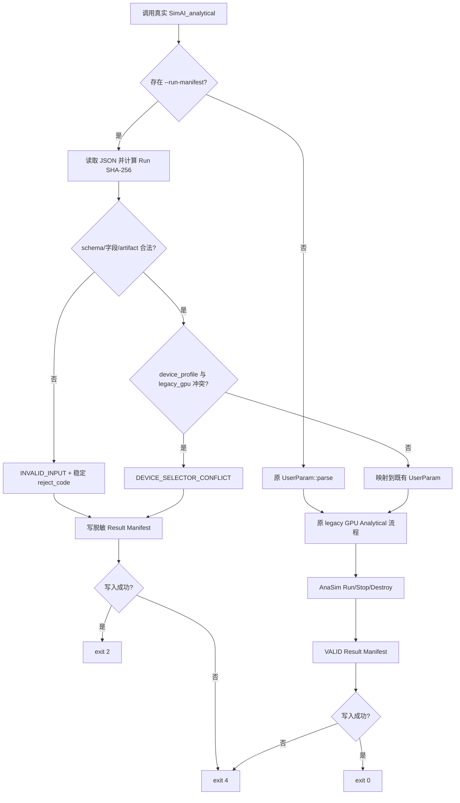
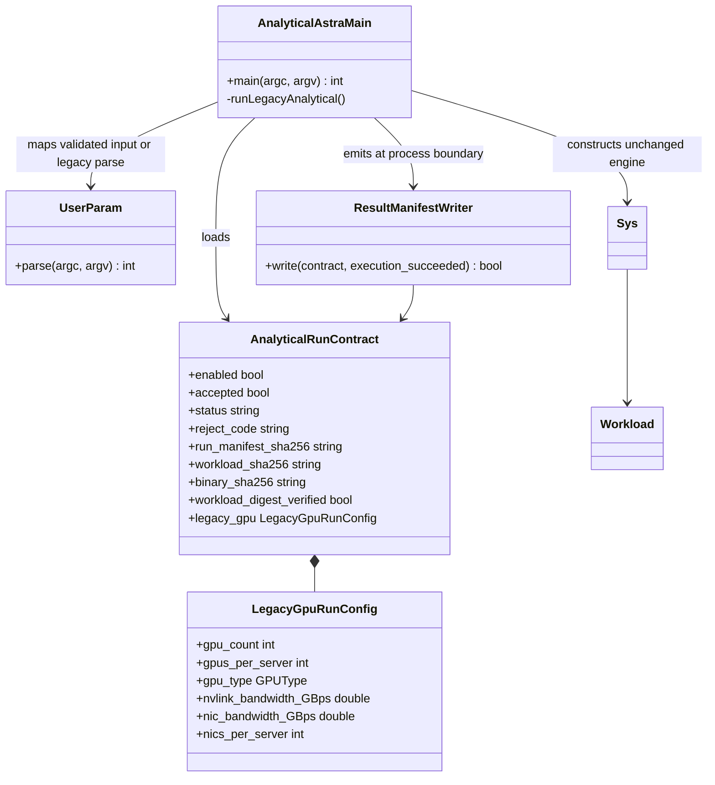

# Issue #16：Shared Run Contract 与 Analytical 兼容入口设计

## 1. 目标、范围与上游规格

本设计实现 [Issue #16](https://github.com/Kirrito-k423/SimAI-Ascend/issues/16)，其父规格是 [Issue #15](https://github.com/Kirrito-k423/SimAI-Ascend/issues/15)。目标是在不改变无 manifest 时的 Upstream SimAI GPU CLI 行为的前提下，让真实 `SimAI_analytical` 接受版本化 JSON Run Manifest，并在调用者指定的位置输出结构化 JSON Result Manifest。Shared Run Contract 是本票唯一的产品级测试 seam。

本票范围包括：

- `simai.run/v1` 的最小 legacy GPU Analytical 输入；
- `simai.result/v1` 的状态、稳定拒绝码、摘要、provenance、evidence、readiness 与显式 `UNKNOWN`；
- `device_profile` 与 `legacy_gpu` 同时出现时 fail closed；
- 保持不含 `--run-manifest` 的旧 CLI 入口不变；
- 真实进程黑盒测试与脱敏合成 fixture。

本票不加载 Ascend Profile、不实现 HCCL `CollectiveCostModel`、不修改 Simulation，也不复制原型中的 fake `424242 ns`、TUI 或 `Prototype` 类型。后续票可在相同 contract 入口上增加 Profile/cost model 能力。

## 2. 4+1 架构视图

### 2.1 逻辑视图

`RunContract` 是 Analytical 前端边界上的深模块：它解析/校验 JSON、计算输入与当前进程真实可执行文件的 SHA-256、形成稳定状态，并只把已校验的 legacy GPU 配置交给既有 `UserParam`。可执行文件通过操作系统进程身份解析，PATH、相对路径或执行型包装器不会使摘要退化为 `UNKNOWN`。既有 `Sys`、`Workload`、`Layer`、`cal_busbw` 不知道 Run Manifest 的存在。

Result Manifest 将证据与可执行就绪性分开：workload 可以是 `USER_PROVIDED` evidence，同时 Analytical backend 为 `READY`；尚未接入的 HBM、traffic、Fault Goodput 等结果保持字符串哨兵 `UNKNOWN`，不得用 0 或空对象冒充已计算结果。

### 2.2 开发视图

- `AnalyticalAstra.cc`：选择 contract 模式或原 legacy CLI 模式，并调用真实 Analytical 生命周期。
- `RunContract.h/.cc`：contract 模型、严格 JSON 读取、真实可执行文件解析、SHA-256、校验与脱敏 Result Manifest 序列化；GPU 名称只在此处映射一次为 `GPUType`。
- `tests/contract/test_analytical_run_contract.py`：只从真实进程边界观察退出状态与 Result Manifest；legacy CLI 回归只观察退出状态。
- `tests/contract/fixtures/`：公开、合成、单层最小 workload 及正/负 Run Manifest。

Analytical CMake 目标已使用 `*.cc` glob，因此新增的 `RunContract.cc` 自动进入真实 `SimAI_analytical` 可执行文件，不引入第三方运行时依赖。

### 2.3 进程视图



contract 正例与冲突负例不会并行共享内部对象。相同 Run Manifest、workload 与二进制会得到逐字段相同的 Result Manifest；二进制变化会改变 `binary_sha256`。既有 CSV 仍由原流程产生，但它不是本票的验收 seam。

### 2.4 物理视图

本票仅需要 CPU 和本机 C++ 工具链。进程从调用工作目录解析 workload 相对路径，读取公开 artifact，并把 Result Manifest 写入调用者通过 `--result-manifest` 指定的位置。Result Manifest 不记录 manifest/workload/binary 的本地路径，不记录 stdout/stderr，也不接触远程主机、IP、账号、token 或原始内部日志。

未执行 NPU 验证；#16 不依赖 NPU、CANN 或 HCCL。

### 2.5 场景视图（+1）

1. 最小 legacy GPU manifest：校验版本与字段，计算摘要，复用真实 legacy Analytical 路径，exit 0，输出 `VALID/NONE`。
2. 旧 CLI：没有 `--run-manifest`，直接调用原 parser，最小 workload 仍 exit 0。
3. 设备选择冲突：同一 Run Manifest 同时含 `device_profile` 与 `legacy_gpu`，不启动 Analytical workload，exit 2，输出 `INVALID_INPUT/DEVICE_SELECTOR_CONFLICT`。
4. 缺失定量能力：运行本身可合法完成，但 HBM、traffic、Useful Throughput、Top-5、代表配置与 Fault Goodput 仍输出 `UNKNOWN`。
5. workload 摘要不匹配：不启动 Analytical workload，exit 2，输出 `INVALID_INPUT/WORKLOAD_DIGEST_MISMATCH`，并把 workload readiness 标为 `BLOCKED`。
6. Result Manifest 目标不可写：无论输入原本将被接受还是拒绝，固定 exit 4，不用输入错误 exit 2 掩盖输出失败。

## 3. 类图与职责



`RunContract` 不持有或模拟 `Sys` 内部对象；测试也不实例化这些类型。

## 4. 典型程序运行流程

### 4.1 输入与协作

contract 模式的 CLI 为：

```text
SimAI_analytical \
  --run-manifest <run.json> \
  --result-manifest <result.json>
```

最小 `simai.run/v1`：

```json
{
  "schema_version": "simai.run/v1",
  "run_id": "legacy-gpu-minimal",
  "backend": "analytical",
  "workload": {
    "path": "public/minimal_workload.txt",
    "sha256": "sha256:<64 lowercase hex digits>"
  },
  "legacy_gpu": {
    "gpu_count": 1,
    "gpus_per_server": 1,
    "gpu_type": "H100",
    "nvlink_bandwidth_GBps": 360.0,
    "nic_bandwidth_GBps": 48.5,
    "nics_per_server": 1
  }
}
```

相对 workload path 以进程工作目录为基准。入口计算 Run Manifest、workload 和当前真实二进制的 SHA-256；调用者不需要信任进程自己回显的 path。macOS 使用当前进程的 `_NSGetExecutablePath`，Linux 使用 `/proc/self/exe`，并以 `argv[0]` 的相对/PATH 解析为可移植回退；所有候选都会规范化后再读取，因此摘要描述实际运行的二进制而不是调用字符串。

### 4.2 校验与状态

校验顺序是 CLI 形状、JSON、schema version、safe `run_id`、backend、workload 可读性、设备选择互斥、legacy GPU 字段与整除关系。当前稳定拒绝码包括：

- `RUN_CONTRACT_CLI_INVALID`
- `RUN_MANIFEST_NOT_FOUND`
- `RUN_MANIFEST_INVALID_JSON`
- `RUN_SCHEMA_VERSION_MISSING`
- `RUN_SCHEMA_VERSION_UNSUPPORTED`
- `RUN_ID_INVALID`
- `BACKEND_UNSUPPORTED`
- `WORKLOAD_REFERENCE_MISSING`
- `WORKLOAD_DIGEST_INVALID`
- `WORKLOAD_NOT_FOUND`
- `WORKLOAD_DIGEST_MISMATCH`
- `DEVICE_SELECTOR_CONFLICT`
- `LEGACY_GPU_CONFIG_INVALID`

合法执行使用 `status=VALID`、`reject_code=NONE`、exit 0。输入拒绝使用 `status=INVALID_INPUT`、exit 2。任何 Result Manifest（包括输入拒绝结果）目标不可写时进程统一 exit 4，并只输出固定 stderr 提示，因为目标本身不可用于表达结构化失败。

### 4.3 输出与失败/UNKNOWN/BLOCKED 传播

`simai.result/v1` 顶层固定包含：

- `schema_version`、`run_schema_version`、`run_id`、`backend`；
- `status`、`reject_code`、静态 `message` 与最小修复 `remediation`；
- `input_summary`：Run/workload digest、accelerator 摘要、GPU 数；
- `provenance`：仓库身份、真实二进制 digest、workload/profile digest、成本模型身份；
- `evidence`：输入来源等级与 digest；
- `readiness`：contract、workload、backend、profile、HBM、traffic；
- `results`：validity 及 timing/HBM/traffic/throughput/Top-5/代表配置/Fault Goodput。

传播规则：

- device selector 冲突立即 `INVALID_INPUT`，contract/backend readiness 为 `BLOCKED`，定量结果和 validity 为 `UNKNOWN`；
- workload 内容摘要与声明不匹配时，workload readiness 为 `BLOCKED`；只有摘要实际验证成功才为 `READY`，摘要尚不可得才为 `UNKNOWN`；
- 未消费的 Ascend Profile、HBM、traffic 与搜索/故障能力保持 `UNKNOWN`，绝不继承 legacy GPU 默认值；
- workload evidence 可为 `USER_PROVIDED`，但这不会把尚未实现的定量输出提升为 `READY`；
- Result Manifest 不复制路径、原始日志或输入中的任意自由文本；`run_id` 只允许受限 ASCII，错误消息为固定文本。

## 5. 关键接口与数据契约

`LoadAnalyticalRunContract(argc, argv)` 返回：

- `enabled=false`：调用方必须走原 legacy CLI parser；
- `enabled=true, accepted=false`：不得构造 `Sys`，应先写拒绝 Result Manifest 并返回稳定 exit code；
- `enabled=true, accepted=true`：只把 `LegacyGpuRunConfig` 的已校验字段映射到 `UserParam`。

`WriteAnalyticalResultManifest(contract, execution_succeeded)` 只序列化 contract 的受控字段和摘要，不序列化文件路径或日志。`UNKNOWN` 是 v1 的显式字符串哨兵，表示“没有足够输入/能力产生该值”，与数值 0、空集合或执行失败不同。

## 6. 取舍与 ADR

- 遵循 [ADR 0001](../adr/0001-derive-from-upstream-simai-history.md)：只在 Upstream Analytical 入口增加 adapter，保留真实 `Sys`/`Workload`/`Layer` 和历史身份，不建立独立模拟器。
- 遵循 [ADR 0005](../adr/0005-separate-analytical-cost-from-simulation-flow.md)：#16 不把 Ascend Profile 静默映射到 GPU/NCCL；冲突 fail closed；本票不提前实现 HCCL cost/flow provider。
- 使用进程入口 adapter 而非修改共享 `AstraParamParse`：避免 Simulation/Physical backend 意外获得未实现的 contract 语义。
- GPU 类型名称在 contract 校验中集中映射为 `GPUType`，主入口只消费已校验枚举；未知名称拒绝且不会再默认回退到 H20。
- 使用内置、无外部依赖的严格 JSON reader 与 SHA-256：保持 Upstream 构建依赖不变。代价是 v1 parser 当前只需要覆盖 contract 所用 JSON 类型与转义集合，后续 schema 扩展应优先引入统一 schema 验证层。
- 结果不解析既有 CSV 来猜测 timing 单位；在单位/语义未形成独立契约前诚实输出 `UNKNOWN`。

## 7. 测试 seam 与验收映射

所有 product contract 测试都启动真实 `SimAI_analytical` 子进程，不 mock、不查询内部对象，也不绑定类布局。

| Issue #16 验收项 | 证据 |
| --- | --- |
| 1. 最小 Run Manifest 启动并输出 Result Manifest | `test_minimal_legacy_gpu_manifest_runs_real_analytical_process`：exit 0 + JSON parse |
| 2. 版本/状态/拒绝码/摘要/provenance/evidence/readiness/UNKNOWN | 正例逐字段断言；摘要由 Python `hashlib` 独立计算；摘要漂移负例断言 `WORKLOAD_DIGEST_MISMATCH` 与 workload `BLOCKED` |
| 3. 无 Ascend Profile 的 GPU workload 与旧 CLI | 正例选择 `LEGACY_CALBUSBW`；`test_minimal_gpu_workload_keeps_legacy_cli_compatible` exit 0 |
| 4. Ascend 与 legacy GPU 冲突 fail closed | `test_conflicting_device_selectors_fail_closed`：exit 2 + `DEVICE_SELECTOR_CONFLICT` |
| 5. 真实进程黑盒 seam | 测试只观察 subprocess return code 与 Result Manifest；PATH 启动与仓外干净构建产物的相对路径启动都独立校验真实二进制摘要；不可写负例只断言 exit 4；旧 CLI 只观察 return code |
| 6. artifact 脱敏 | 正/负结果断言无仓库/fixture path 与 IPv4；fixture 全为合成公开值；提交前另跑敏感信息扫描 |

Independent verification 应从干净构建产物运行上述正/负 fixture，并独立重算 Run/workload/binary SHA-256。`test_same_manifest_has_deterministic_result_fields` 通过真实进程对同一 manifest 连续运行两次，并逐字段比较两个 Result Manifest，落实父规格的确定性规则。

## 8. 限制与后续依赖

- Profile-only Ascend Analytical、HCCL cost model 与 A2/A3/A5 evidence 不在 #16；不得把本票结果解释为 Ascend 性能支持。
- `timing_ns`、HBM、traffic、Useful Throughput、Top-5、代表配置和 Fault Goodput 仍为 `UNKNOWN`，等待各自生产实现与单位契约。
- 相对 artifact path 当前以进程工作目录为基准；若未来支持远程 artifact resolver，需要独立的内容寻址和下载安全策略。
- 既有 workload 深层解析仍可能在引擎内部直接终止进程；#16 的可验证承诺覆盖已校验、可运行的最小 legacy workload 与入口级拒绝。后续可将 workload 语义预校验提升到 contract gate。
- 同一 Run Manifest 的既有 CSV 前缀由 manifest digest 派生；并发运行相同 manifest 时，旧 CSV writer 的并发隔离仍是上游限制，Result Manifest 路径由调用者隔离。
- 未执行 NPU 验证；验证机器为 macOS arm64 CPU 开发机。
