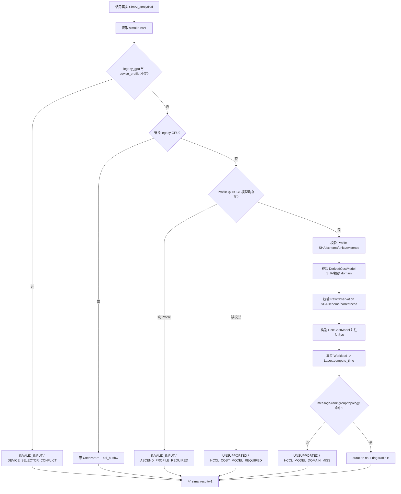
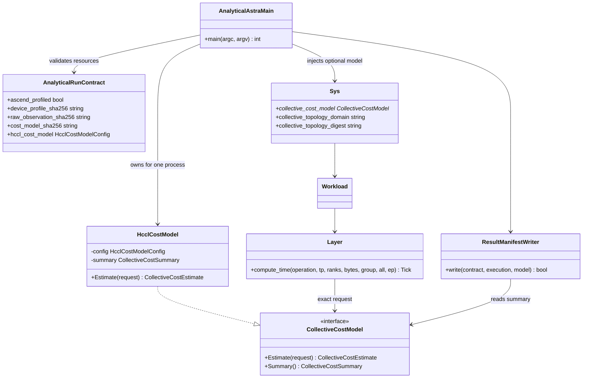

# Issue #17：首个 Ascend AllReduce Analytical Vertical Slice 设计

## 1. 目标、范围与父链

本设计实现 [Issue #17](https://github.com/Kirrito-k423/SimAI-Ascend/issues/17)，父规格为 [Issue #15](https://github.com/Kirrito-k423/SimAI-Ascend/issues/15)，直接依赖已完成的 [Issue #16](https://github.com/Kirrito-k423/SimAI-Ascend/issues/16)。目标是让真实 `SimAI_analytical` 在保留 legacy GPU 行为的同时，消费一个最小 Ascend Profile、不可变 HCCL RawObservation 和 DerivedCostModel，把一个 HCCL AllReduce 成本注入既有 Analytical `Sys -> Workload -> Layer::compute_time()` 流程，并通过 Shared Run Contract 输出 timing、traffic、provenance、evidence 与 readiness。

本票范围仅包括：

- `ALL_REDUCE` 的精确消息/rank/group/拓扑域模型匹配；
- Profile、RawObservation、DerivedCostModel 三层资源和内容摘要校验；
- 规范单位 `B`、`B/s`、`FLOP/s`、`ns`（rank 等无量纲计数使用 `count`）；
- `USER_INPUT`/`DERIVED` evidence 与 `FIELD_UNVERIFIED` 字段就绪度的正交表达；
- 显式 Ascend 请求缺 Profile、缺模型或运行时超域时 fail closed；
- #16 的 legacy GPU Run Contract 与旧 CLI 回归。

本票不实现 AllGather、ReduceScatter、AllToAll、AllToAllV，不实现 HCCL Simulation flow provider，不采集 NPU 测量，也不承诺 A2/A3/A5 精度。后续 collective 属于 #18 或更后续票，不能由本实现的枚举或接口外观推断为已支持。

## 2. 4+1 架构视图

### 2.1 逻辑视图

Shared Run Contract 仍是唯一产品验收边界。`RunContract` 在 backend 入口验证三层资源的 schema、摘要、规范单位和精确适用域，并只把已验证的 `HcclCostModelConfig` 交给生产 `HcclCostModel`。Profile 描述设备/拓扑事实或假设，RawObservation 保持不可变，DerivedCostModel 通过 RawObservation SHA-256 引用输入；重拟合必须产生新模型和新摘要，不能回写 raw。

`CollectiveCostModel` 是 Upstream Analytical 流程中的可选 seam。`Sys` 保存非拥有指针及当前拓扑域；`Layer::compute_time()` 把原 workload 已有的 operation、message bytes、rank count、group type、TP/EP size 与 `Sys` 拓扑上下文组成请求。模型命中时直接返回 standalone HCCL duration，绝不再转成 bus bandwidth 或套 NVIDIA ring factor；未注入时才委托原 `cal_busbw` 路径。

Result Manifest 中两类状态分开：

- `evidence.*.level/readiness` 描述数字从哪里来、字段是否在目标现场验证；
- 顶层 `readiness.*` 描述当前资源是否足以执行本次 Analytical 请求。

因此本票的公开 worked example 可以是 `USER_INPUT + FIELD_UNVERIFIED`，同时 `ascend_profile/hccl_cost_model/traffic = READY`，但绝不能升级为 `MEASURED`。

### 2.2 开发视图

- `system/CollectiveCostModel.hh/.cc`：backend 中立的请求、估值、汇总及可选 provider ABI。
- `analytical/HcclCostModel.h/.cc`：#17 的严格单域 AllReduce `ALPHA_BETA` 模型和 ring traffic 记账。
- `system/Sys.hh/.cc`：以末尾可选构造参数保存模型及拓扑上下文，保持所有旧调用点源码兼容。
- `workload/Layer.cc`：把既有 workload 语义转换为 provider 请求；无 provider 时执行未改变的 legacy 分支。
- `analytical/RunContract.h/.cc`：读取/验证三层 artifact，形成配置，输出 `simai.result/v1`。
- `analytical/AnalyticalAstra.cc`：在 contract 入口组装模型、注入 `Sys`、运行真实引擎并按模型汇总决定进程状态。
- `tests/contract/test_analytical_run_contract.py`：只观察真实进程退出状态和 Result Manifest。
- `tests/contract/fixtures/`：公开、脱敏、合成的 4-rank HOST/TP 1 MiB worked example 与 fail-closed 输入。

### 2.3 进程视图



每次进程拥有独立模型实例和汇总状态。相同二进制、Run Manifest、workload 及三层 artifact 会产生确定的结果字段；任一 artifact 内容变化必须先改变声明摘要，否则入口拒绝。

### 2.4 物理视图

本票只需 CPU 和 C++17 工具链。`SimAI_analytical` 从调用工作目录解析 artifact path，读取公开 JSON/workload，并把 Result Manifest 写到调用者指定路径。Result Manifest 只包含内容摘要和受控标识，不包含本地路径、stdout/stderr、私有主机、IP、账号、token 或原始日志。

本地 macOS arm64 环境没有 CMake，因此验证从仓库 CMake 的 source glob/exclude 规则派生等价的干净 Clang 全源码链接；没有读取远端配置，没有使用 NPU/CANN/HCCL runtime，也没有 NPU 锁等待。

### 2.5 场景视图（+1）

1. 有效 Ascend AllReduce：4 ranks、TP group、HOST domain、每 rank 1 MiB，输出 `VALID/NONE`、`61943 ns`、`6291456 B` 和三层 provenance。
2. legacy GPU manifest：不提供 Profile/provider，继续走 `LEGACY_CALBUSBW`，#16 外部行为保持。
3. 旧 CLI：不提供 `--run-manifest`，继续由原 parser 和 GPU Analytical 流程处理。
4. HCCL model 缺 Profile：入口返回 exit 2、`INVALID_INPUT/ASCEND_PROFILE_REQUIRED`，不构造 `Sys`。
5. Profile 缺 cost model：入口返回 exit 3、`UNSUPPORTED/HCCL_COST_MODEL_REQUIRED`，不回退 GPU/NCCL。
6. 运行时消息超域：Profile/model 合法，但 2 MiB workload 超出模型精确 1 MiB domain；真实 `Layer` 请求使模型记录 domain miss，Result 为 exit 3、`UNSUPPORTED/HCCL_MODEL_DOMAIN_MISS`，timing/traffic 保持 `UNKNOWN`。
7. 三层摘要漂移、非法单位、模型/Profile/Raw domain 不一致、raw correctness 非 PASS、raw 不可用于 fit、声明允许外推或 `FIELD_UNVERIFIED + MEASURED`：入口 fail closed。

## 3. 类图与职责



`Sys` 不拥有 provider；backend 入口保证其生命周期覆盖 `AnaSim::Run/Stop/Destroy` 和 Result Manifest 写出。旧 NS-3/Physical/Analytical 构造点不传末尾参数，得到 `nullptr`，因此不会意外获得 Ascend 语义。

## 4. 典型程序运行流程

### 4.1 输入与资源协作

CLI 沿用 #16：

```text
SimAI_analytical \
  --run-manifest <run.json> \
  --result-manifest <result.json>
```

Ascend Run Manifest 新增两个内容寻址引用：

```json
{
  "device_profile": {
    "path": "minimal_ascend_profile.json",
    "sha256": "sha256:<profile digest>"
  },
  "collective_cost_model": {
    "path": "minimal_hccl_allreduce_cost_model.json",
    "sha256": "sha256:<model digest>"
  }
}
```

DerivedCostModel 的 `inputSamples[]` 再以 path + SHA-256 引用一个不可变 RawObservation。模型 `profileDigest`、raw `profileDigest/profileRef`、三者 topology/group/message domain 必须一致。入口不会从相邻 rank、相邻拓扑或 legacy bus bandwidth 猜测缺失模型。

### 4.2 校验、组装与状态传播

校验按以下顺序 fail closed：

1. #16 Run schema、workload path/digest、backend 与 device selector 互斥；
2. Profile artifact 可读、摘要匹配、API/kind/version/identity/topology/evidence 和规范单位合法；
3. DerivedCostModel artifact 可读、摘要匹配、只声明 `ALL_REDUCE + BF16 + SUM + DEVICE_ONLY + ALPHA_BETA + RING`，精确 rank/group/scope/topology/message domain，且 `extrapolation.allowed=false`；
4. RawObservation artifact 可读、摘要匹配、Profile/domain 一致、canonical bytes 语义、normalized ns/B/s、correctness PASS、eligibility fit；
5. `FIELD_UNVERIFIED` 资源不得包含 `MEASURED` 声明；
6. 构造 provider 并注入真实 `Sys`；
7. `Layer::compute_time()` 的真实 workload 请求再次执行运行时 domain gate。

入口拒绝时不构造 `Sys`。运行时 domain miss 时 `Layer` 返回 0 只用于让既有 report 生命周期安全结束，同时 provider 记录 `unsupported_request`；主进程据此输出 exit 3 和 `UNKNOWN` timing/traffic。该 0 不是一个有效估值，也不会进入 Result Manifest。

### 4.3 成本和流量口径

本票的模型公式是：

```text
duration_ns = round(startup_ns + message_B / bandwidth_Bps × 1,000,000,000)
```

固定 worked example：

```text
round(20,000 ns + 1,048,576 B / 25,000,000,000 B/s × 1e9)
= 61,943 ns
```

AllReduce ring 的 `traffic_B` 是整个 group 的算法展开总字节：

```text
2 × (rank_count - 1) × message_bytes_per_rank
= 2 × 3 × 1,048,576 B
= 6,291,456 B
```

`message_bytes_per_rank` 的语义是 HCCL API 输入 buffer 的逻辑字节，发生在算法展开前。`traffic_B` 不是物理链路 line rate，也不是 HCCL native `alg_bandwidth`。

### 4.4 输出与 UNKNOWN/BLOCKED 传播

有效结果在 #16 `simai.result/v1` 上增加：

- `input_summary.accelerator = ASCEND_PROFILED`；
- `provenance.device_profile_sha256/cost_model_sha256/raw_observation_sha256`；
- `provenance.cost_model = HCCL_DERIVED`；
- 三层 `evidence.level/readiness/digest`；
- execution readiness：`ascend_profile/hccl_cost_model/traffic = READY`；
- `results.timing_ns`、`results.traffic_B` 和 operation/message/rank/group/topology 摘要。

缺 Profile、缺模型、摘要/Schema 冲突或运行时超域时：

- 状态为 `INVALID_INPUT` 或 `UNSUPPORTED`，使用稳定 reject code；
- `results.validity/timing_ns/traffic_B/collective = UNKNOWN`；
- 不产生 0 timing，不选择 `LEGACY_CALBUSBW`，不调用 `cal_busbw` 估算 Ascend；
- 已验证 workload 可保持 `READY`，被阻断的 contract/model 为 `BLOCKED/UNKNOWN`，不把局部证据扩散成整体可执行。

## 5. 接口与数据契约

### 5.1 `CollectiveCostRequest`

生产 provider 请求包含：

- `collective`；
- `message_bytes_per_rank`（B）；
- `rank_count` 与 `group_type`；
- `tp_size`、`ep_size`；
- `topology_domain` 与 `topology_digest`。

`CollectiveCostEstimate.supported=false` 表示没有适用模型，调用方不得把 duration 0 当作结果。`CollectiveCostSummary` 记录本进程的命中、domain miss、累计 duration/traffic 和最后一个受支持请求的外部摘要。

### 5.2 三层资源

| 层 | API | 可变性 | #17 消费字段 |
| --- | --- | --- | --- |
| Profile | `simai.ascend.profile/v1alpha1` | 新事实产生新 artifact/digest | Ascend identity、rank count、HOST topology、B/B/s/FLOP/s 数值、evidence/readiness |
| RawObservation | `simai.ascend.observation/v1alpha1` | 不可变；模型只能按 SHA 引用 | AR、API input B、rank/group/scope/topology、normalized ns/B/s、correctness/fit |
| DerivedCostModel | `simai.ascend.costmodel/v1alpha1` | 重拟合产生新 artifact/digest | exact domain、alpha/beta、ring traffic、raw/profile digests、DERIVED/FIELD_UNVERIFIED |

所有已消费物理单位只允许 `B`、`B/s`、`FLOP/s`、`ns`；计数使用 `count`。JSON native path 不进入 Result Manifest，只输出 SHA-256。

## 6. ADR 取舍

- 遵循 [ADR 0001](../adr/0001-derive-from-upstream-simai-history.md)：通过可选 seam 修改真实 Upstream `Sys/Layer` 流程，不建立独立 simulator，也不改变无 provider 的 legacy 分支。
- 遵循 [ADR 0003](../adr/0003-publish-only-sanitized-calibration-evidence.md)：fixture 是公开 worked example，不含地址、账号、凭据、远端清单或原始日志；只发布结构化摘要与 evidence。
- 遵循 [ADR 0005](../adr/0005-separate-analytical-cost-from-simulation-flow.md)：本票只实现 `CollectiveCostModel`；不提供 Simulation `CollectiveFlowProvider`，不复用 Mock NCCL，不合并两种职责。
- 使用 latency provider 而非把 HCCL 重新编码成 `GPUType/cal_busbw`：避免二进制/十进制带宽混用、NVIDIA 小消息常量、未知 rank 默认列和额外 ring factor。
- `Sys` 使用非拥有可选指针而不是全局单例：保持旧构造点兼容，并让每个真实进程/运行拥有独立模型汇总。
- #17 的 parser 严格限定一个 raw sample、一个精确 model domain、无插值/外推；这是对首个垂直切片的诚实边界，不是完整 registry。

## 7. Test seam 与验收映射

所有产品测试只启动真实 `SimAI_analytical`，只断言进程退出状态和 Result Manifest；测试不实例化 provider，不读取 `Sys/Layer` 内部状态，不 mock 内部协作者。

| Issue #17 验收项 | 进程边界证据 |
| --- | --- |
| 1. Profile/raw/model 分层与规范单位 | 有效 fixture 的三个独立 SHA 出现在 provenance；入口 schema/units/domain validator；结果 evidence 分层 |
| 2. 按 bytes/rank/group/topology 注入 | 有效结果 `collective` 为 1 MiB/4/TP/HOST；worked example 独立期望 `61943 ns`；2 MiB 真实 workload 产生 domain miss |
| 3. 真实进程输出 VALID/timing/traffic/provenance | `test_minimal_ascend_allreduce_uses_profiled_hccl_cost`：exit 0、VALID、61943 ns、6291456 B、三层 digest |
| 4. 缺 Profile/模型绝不 GPU/NCCL fallback | `test_hccl_model_without_ascend_profile_fails_closed` 与 `test_ascend_profile_without_hccl_model_is_unsupported`；timing/traffic UNKNOWN |
| 5. evidence/readiness 分离，FIELD_UNVERIFIED 不得 MEASURED | 有效结果逐层断言 USER_INPUT/DERIVED + FIELD_UNVERIFIED，整个 evidence 序列化中无 MEASURED；execution readiness 独立为 READY |
| 6. #16 legacy GPU 回归 | 原 8 项完整保留并随新增 4 项一起运行 |

Independent verification 使用固定 fixture 运行一个有效 AllReduce 和缺 Profile 负例；前者只从 Result Manifest 检查 timing/traffic/provenance，后者检查 exit 2、`ASCEND_PROFILE_REQUIRED` 和 UNKNOWN 定量结果。完整 suite 还覆盖缺模型与运行时超域。

## 8. 限制与后续依赖

- 仅支持 DerivedCostModel 明确声明的 `ALL_REDUCE/BF16/SUM/DEVICE_ONLY/ALPHA_BETA/RING`；其他 collective 不在 #17。
- 模型只允许一个 raw sample 和一个精确 message/rank/group/topology domain，不插值、不外推；完整 registry、分段曲线和多样本拟合属于后续工作。
- `traffic_B` 是 ring 算法 group total，不含共享链路争用、overlap 或逐 link/domain matrix；后续 Simulation flow 与 Projected A2A 必须使用独立能力。
- Profile 中 HBM 字段被验证为规范单位，但本票不消费 HBM feasibility，所以 `hbm_peak_B`/HBM readiness 保持 `UNKNOWN`。
- worked example 是脱敏合成 `USER_INPUT/FIELD_UNVERIFIED`，不是 A2/A3 测量、不是 A5 估计准确性证明；未执行 NPU 测试。
- 旧 workload 的深层语义仍由 Upstream parser 处理；运行时 provider gate 是防止 workload 与已验证 model domain 漂移的第二道边界。
- Simulation 尚无 HCCL `CollectiveFlowProvider`；Ascend Simulation 仍必须显式 unsupported，不能从本票的 Analytical 支持推断出来。
