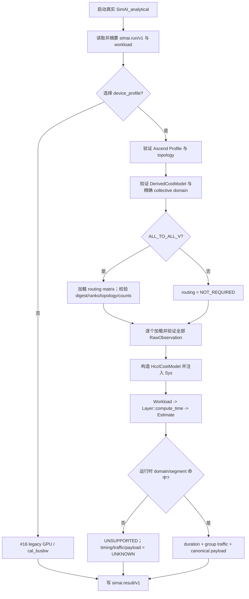
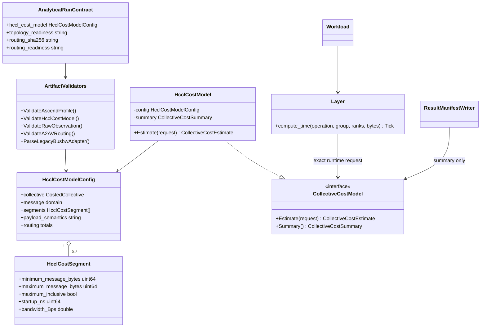

# Issue #18：完整 HCCL Analytical Collective 支持设计

## 1. 目标、范围与依赖

本设计实现 [Issue #18](https://github.com/Kirrito-k423/SimAI-Ascend/issues/18)，父规格为 [Issue #15](https://github.com/Kirrito-k423/SimAI-Ascend/issues/15)，直接建立在 #16 Shared Run Contract 与 #17 首个 Ascend AllReduce vertical slice 上。目标是在真实 `SimAI_analytical` 进程中，以同一条 Run/Result Manifest 边界完整支持 HCCL `ALL_REDUCE`、`ALL_GATHER`、`REDUCE_SCATTER`、均匀 `ALL_TO_ALL` 和计数矩阵驱动的 `ALL_TO_ALL_V`，并同时提供规范 payload、时延、算法总流量、分段成本、可追溯观察样本以及 fail-closed readiness。

本票包含：

- 五类 collective 的独立 workload 请求、精确模型域匹配和规范 Result payload；
- RawObservation 的 message/rank/group/topology、algorithm、statistics、normalized timing/bandwidth 与 evidence 校验；
- 单段 `ALPHA_BETA` 和连续、无空洞的 `PIECEWISE_ALPHA_BETA`；
- A2AV 不可变 routing matrix 及其 profile/topology/model digest 闭包；
- legacy bus bandwidth 的显式 typed adapter，禁止隐式猜单位、列和适用域；
- topology、routing、collective cost 三种缺失资源的独立 reject code/readiness；
- #16 legacy GPU 与 #17 AllReduce 的完整回归。

本票不创建 Target Workload、GTS/显存可行性、搜索或故障 goodput，不实现 Simulation flow provider，也不从 GPU/NCCL 模型推断 Ascend 成本。以上能力仍由其各自后续 Issue 承担。

## 2. 4+1 架构视图

### 2.1 逻辑视图

`simai.run/v1 -> SimAI_analytical -> simai.result/v1` 仍是唯一产品边界。入口先验证 workload 与内容寻址的 Profile、DerivedCostModel、全部 RawObservation；A2AV 还必须验证单独的 routing artifact。只有完整闭包通过后，入口才把 `HcclCostModelConfig` 注入 #17 已建立的 `CollectiveCostModel` seam。

模型同时承担两类职责：

1. 运行时域 gate：operation、message bytes、rank count、group type、topology domain/digest 必须精确命中；
2. 确定性计算：选择单段或唯一分段，计算 duration、collective payload 与算法展开后的 group-total traffic。

任一 gate 失败都由 provider 记录为 unsupported，Result Manifest 输出 `UNKNOWN`，不会进入 `cal_busbw`。legacy GPU 仍只在未选择 `device_profile` 的 #16 路径上使用原 `cal_busbw`。

### 2.2 开发视图

- `system/Common.hh`：增加 Upstream workload 可表达的 `All_to_Allv` operation。
- `system/CollectiveCostModel.hh/.cc`：扩展 backend 中立的 operation 与 payload summary；保留 #17 的抽象接口。
- `workload/Workload.cc`：把 `ALLTOALLV[_EP|_DP_EP]` 解析为独立 operation，避免被 `ALLTOALL` 前缀吞掉。
- `workload/Layer.cc`：把五类 `ComType` 映射为 provider 请求；有 provider 时仍在 legacy 分支之前返回。
- `analytical/HcclCostModel.h/.cc`：实现 collective 公式、分段选择、overflow/domain gate 和 A2AV routing 汇总。
- `analytical/RunContract.h/.cc`：验证 Profile/model/raw/routing，解析 explicit busbw adapter，输出 payload/provenance/evidence/readiness。
- `tests/contract/test_analytical_run_contract.py`：只启动真实进程并读取 Result Manifest，不绑定内部类结构。
- `tests/contract/fixtures/`：保存脱敏 Profile、workload、RawObservation、DerivedCostModel；测试生成的多点/routing artifact 同样只含合成公开数据。

### 2.3 进程视图



artifact 校验失败发生在构造 `Sys` 之前；运行时 domain miss 发生在真实 workload 已解析之后。两者都写 Result Manifest，但前者返回稳定输入/资源拒绝码，后者返回 `HCCL_MODEL_DOMAIN_MISS`。

### 2.4 物理视图

本实现仅依赖 CPU、文件系统与 C++11 编译能力。Run Manifest 引用公开 JSON/workload，Result Manifest 只输出摘要和受控枚举，不回显 path、stdout/stderr、主机/IP、账号、凭据或原始日志。

开发验证运行在本地 macOS arm64。环境没有 CMake，因此从仓库 CMake 的 glob/exclude 规则导出完全等价的 61-source Clang 链接集合。实现与测试不读取私有机器配置，不连接远端，不运行 NPU/CANN/HCCL runtime，故无 NPU 锁等待。

### 2.5 场景视图（+1）

1. `ALL_REDUCE`：1 MiB/4 ranks/TP/HOST，输出 `61943 ns`、`6291456 B`，保持 #17 payload 兼容。
2. `ALL_GATHER`：相同模型点，输出 `61943 ns`、`12582912 B`，每 rank 输出为 4 MiB。
3. `REDUCE_SCATTER`：输出 `61943 ns`、`3145728 B`，每 rank 输出为 256 KiB。
4. 均匀 `ALL_TO_ALL`：输入是每 rank 总发送字节，输出 `61943 ns`、`3145728 B`，不能解释为 pair bytes。
5. `ALL_TO_ALL_V`：4×4 send-count matrix 的最大 row sum 为 750000 B、最大 column sum 为 925000 B、非对角总和为 2700000 B；Result 绑定 routing SHA-256。
6. 分段 AllGather：4096、65535、65536、1048576 B 分别命中已知点和边界，得到 10205、13277、13277、37853 ns，序列非递减。
7. explicit legacy busbw：37.5e9 B/s 的四 rank AllReduce ring busbw 显式换算为 25e9 B/s algbw；缺 adapter/列、歧义单位、域不一致均拒绝。
8. 缺 topology、A2AV 缺 routing、Profile 缺 collective cost 分别产生独立 `HCCL_TOPOLOGY_REQUIRED`、`HCCL_ROUTING_REQUIRED`、`HCCL_COST_MODEL_REQUIRED`，定量结果保持 `UNKNOWN`。

## 3. 类图与职责



validator 拥有 schema、digest、单位和 evidence 规则；provider 不再读 JSON。`Layer` 只负责从真实 workload 形成请求，不知道分段、routing 或 adapter 的输入格式。Result writer 只消费已验证 contract 与 provider summary。

## 4. 典型程序运行与接口契约

### 4.1 Run Manifest 与 artifact 闭包

五类 collective 都通过各自 workload token 选择操作，通过 `collective_cost_model` 选择唯一模型。A2AV 额外要求：

```json
{
  "routing": {
    "path": "routing.json",
    "sha256": "sha256:<routing digest>"
  }
}
```

DerivedCostModel 的 `routingDigest`、Run reference digest 和 routing 文件内容摘要必须三方相等。routing 使用 `HCCL_SEND_COUNTS_BYTES`、单位 `B`、精确 `rankCount × rankCount` matrix；对角必须为 0，值必须是 JSON 安全范围内的非负整数。Profile/topology/rank 不一致或累计溢出一律拒绝。

DerivedCostModel `inputSamples[]` 可以引用多个不可变 RawObservation。入口逐个执行 path/digest/JSON/schema/domain/timing 残差校验；任一失败都会阻断整个模型。Result 的 primary raw digest 保持 #17 字段兼容，完整 sample 引用集合同时受 DerivedCostModel 自身摘要保护。

### 4.2 RawObservation 契约

除 #17 兼容的原始 AllReduce worked example 外，新增 collective 的 RawObservation 必须显式记录：

- collective、每 rank payload 字节语义、dtype/reduction；
- rank count、group type、scope、topology digest；
- algorithm name/version；
- arithmetic-mean statistic、正 sample count、已排除 warmup；
- normalized average time（`ns`）与 alg bandwidth（`B/s`）；
- correctness `PASS`、eligibility `fit=true`、完整 evidence。

模型预测与 raw time 的残差最多 1 ns；`message_B / time_ns` 推导的 alg bandwidth 与 raw normalized 值相对残差最多 10 ppm。`FIELD_UNVERIFIED` 不能包含 `MEASURED` 声明。

### 4.3 时延、payload 与流量

所有固定大小 collective 使用：

```text
duration_ns = round(startup_ns + message_B / bandwidth_Bps × 1e9)
```

令 `P` 为 rank count，`M` 为模型的每 rank 输入，`S[i][j]` 为 A2AV 从 rank i 到 j 的字节数：

| operation | `M` 的规范语义 | 每 rank 输出 | `traffic_B`（group total） |
| --- | --- | --- | --- |
| AR | in-place buffer bytes | `M` | `2(P-1)M` |
| AG | send bytes | `PM` | `P(P-1)M` |
| RS | total input bytes | `M/P` | `(P-1)M` |
| A2A | total send bytes | `M` | `(P-1)M` |
| A2AV | `max_i Σ_j S[i][j]` | `max_j Σ_i S[i][j]` | `Σ_i Σ_{j!=i} S[i][j]` |

RS 和均匀 A2A 要求 `M % P == 0`。所有乘法、加法和 duration rounding 都在执行前做范围检查。`collective_payload` 固定输出 `semantics/input_B_per_rank/output_B_per_rank/routing_sha256`；非 A2AV 的 routing 值为 `NOT_REQUIRED`。

### 4.4 分段模型

`PIECEWISE_ALPHA_BETA` 使用 `interpolation=SEGMENT_LOCAL`。至少两个 segment；第一个 min 和模型 min 相同，相邻边界必须相接，非末段采用 `[min,max)`，末段采用 `[min,max]` 且 max 等于模型 max。边界两侧公式值差不得超过 1 ns，每段带宽为正且最大 duration 可安全 `llround`。正带宽加连续边界保证分段结果不下降；真实进程测试仍显式检查边界前、边界点和全序单调性。

### 4.5 显式 legacy busbw adapter

只有 `fit.family=LEGACY_BUSBW_ADAPTER` 且存在 `fit.adapter` 时才消费 busbw。adapter 契约要求：

- `schema=simai.legacy.busbw/v1`；
- 明确声明 `collective/message_B/rank_count/bus_bandwidth_Bps` 四列；
- message unit 为 `B`，bus bandwidth unit 为 `B/s`；
- collective、rank count、message min/max 与模型精确一致；
- `conversion=HCCL_RING_BUSBW_TO_ALGBW`。

四 rank ring 的换算是：

```text
AR algbw = busbw × P / (2(P-1))
AG/RS/A2A algbw = busbw × P / (P-1)
```

A2AV 不接受单一 legacy busbw row。Result `provenance.cost_model_adapter=EXPLICIT_LEGACY_BUSBW` 明确记录适配发生；普通模型为 `NONE`。不存在任何按列位置、`GB/s` 文本、相邻消息或默认 rank 的隐式兼容。

### 4.6 readiness 与 UNKNOWN

| 缺失能力 | 状态 / reject code | topology | routing | hccl cost | timing/traffic |
| --- | --- | --- | --- | --- | --- |
| Profile 内无 topology | `UNSUPPORTED/HCCL_TOPOLOGY_REQUIRED` | `UNKNOWN` | `NOT_REQUIRED` | `BLOCKED` | `UNKNOWN` |
| A2AV 无 routing ref | `UNSUPPORTED/HCCL_ROUTING_REQUIRED` | `READY` | `UNKNOWN` | `BLOCKED` | `UNKNOWN` |
| Profile 有效但无 cost model | `UNSUPPORTED/HCCL_COST_MODEL_REQUIRED` | `READY` | `NOT_REQUIRED` | `BLOCKED` | `UNKNOWN` |
| 非 A2AV 有效运行 | `VALID/NONE` | `READY` | `NOT_REQUIRED` | `READY` | 数值 |
| A2AV 有效运行 | `VALID/NONE` | `READY` | `READY` | `READY` | 数值 |

`UNKNOWN` 表示资源或结果不存在；`BLOCKED` 表示已有选择使本次 contract 无法继续；`NOT_REQUIRED` 表示该 collective 不消费该资源。这三者不能互换，也不能升级成 `READY`。

## 5. ADR 取舍

- 遵循 [ADR 0001](../adr/0001-derive-from-upstream-simai-history.md)：扩展真实 Upstream workload/Layer seam，不建立旁路模拟器。
- 遵循 [ADR 0003](../adr/0003-publish-only-sanitized-calibration-evidence.md)：fixtures 全部为合成、脱敏、无现场标识的数据；不发布私有配置或原始日志。
- 遵循 [ADR 0005](../adr/0005-separate-analytical-cost-from-simulation-flow.md)：本票只扩展 Analytical latency/cost provider，不创建 Simulation `CollectiveFlowProvider`。
- 遵循 [ADR 0007](../adr/0007-use-hierarchical-projection-for-analytical-alltoall.md) 的 payload 口径：A2A `data_size` 是每 rank 总 collective input，group network traffic 为 `(P-1)M`，不是把 `M` 当作 pair bytes。
- A2AV routing 作为独立内容寻址 artifact，而不是塞进 workload token：routing 有独立 provenance/readiness，且可以在构造 provider 前完成矩阵与模型域验证。
- 分段使用显式半开/闭区间，不在运行时选择“最近”模型：避免边界双重命中、空洞和无声明外推。
- legacy busbw 在入口一次转换成 canonical algbw，provider 内部始终只处理 `B/s`；这样不会重新引入 GPU/NCCL 小消息常量或二次 ring factor。

## 6. 测试映射与验证 seam

全部产品测试只观察真实 `SimAI_analytical` 的进程退出码和 `simai.result/v1`；不实例化 `HcclCostModel`，不 mock `Sys/Layer`，不读取内部 summary。

| Issue #18 Acceptance Criteria | 黑盒证据 |
| --- | --- |
| 1. AR/AG/RS/A2A/A2AV 独立请求及 canonical payload/timing/traffic | 五个 operation 测试分别通过独立 workload + model 运行；断言 operation、payload semantics、input/output、routing digest、worked-example timing 与 group traffic |
| 2. RawObservation 完整记录；DerivedCostModel 支持分段 | 新 collective raw 构造包含 domain/algorithm/statistics/evidence；多样本模型逐个校验；两段模型真实进程命中 |
| 3. known point、interval boundary、monotonicity | 4096/65535/65536/1048576 四点测试断言精确 ns，且结果排序不下降 |
| 4. legacy busbw 仅显式 adapter | 有效 adapter 断言 provenance 与换算结果；缺 adapter、缺列、`GB/s`、message-domain mismatch 分别断言独立拒绝码和 UNKNOWN |
| 5. routing/topology/cost 可区分 UNKNOWN/readiness | 三个负例分别断言独立 reject code、`UNKNOWN/READY/NOT_REQUIRED/BLOCKED` 组合和 UNKNOWN 定量结果 |
| 6. 真实进程与 legacy 回归 | 同一 30-test contract suite 包含 #16 legacy GPU/CLI、#17 AR 和 #18 全部新增行为 |

独立 message matrix 使用同一固定 Profile/拓扑和确定性 synthetic model，改变 collective 与 message point；所有 Run reference 重新计算 SHA-256。Result 反向核对 operation/payload/timing/traffic/provenance，避免由实现内部状态自证。

## 7. 限制与后续依赖

- 只支持 artifact 明确声明的 BF16、group/topology/message 域；不外推、不自动跨 dtype、rank 或 topology 复用。
- 成本模型描述 device-only collective duration 与算法字节，不包含共享链路争用、计算通信 overlap、逐 link flow 或端到端 step time。
- A2AV duration 以 routing 的最大 per-rank send bytes 选择模型点；完整 per-link contention 需要独立 Simulation 能力，不能从本票结果推导。
- 分段参数由已提供 RawObservation 派生并被一致性校验；本票不实现拟合器、模型 registry 或现场采集。
- 公开 worked examples 是 `USER_INPUT/FIELD_UNVERIFIED`，不宣称 A2/A3 实测精度，更不把 A5 预测标为测量。
- `hbm_peak_B`、吞吐、Top5、representatives 与 fault goodput 仍保持 `UNKNOWN`；这些不属于 #18。
- 后续 Target Workload/搜索能力和 Simulation provider 必须分别消费这里的显式 payload、topology、routing 与 readiness 契约，不能绕过 fail-closed 边界。
