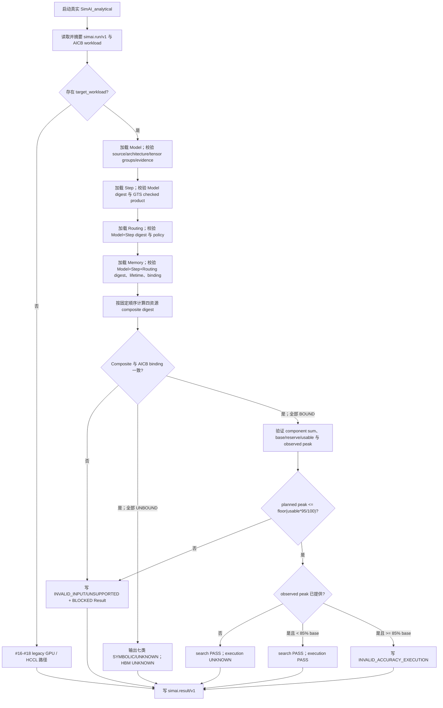
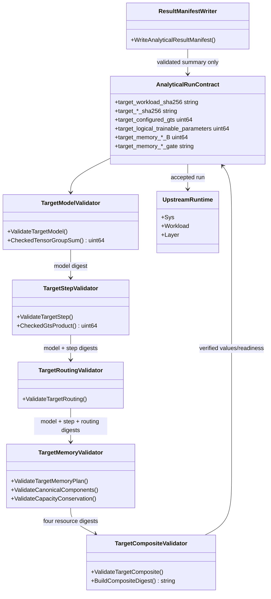

# Issue #19：10T Target Workload、GTS 与显存契约设计

## 1. 目标、范围与依赖

本设计实现 [Issue #19](https://github.com/Kirrito-k423/SimAI-Ascend/issues/19)，父规格为 [Issue #15](https://github.com/Kirrito-k423/SimAI-Ascend/issues/15)，建立在 #16 的 Shared Run Contract、#17 的首个 Ascend Analytical vertical slice 与 #18 的完整 HCCL collective 契约之上。目标是在不建立旁路模拟器的前提下，让真实 `SimAI_analytical` 消费一个内容寻址的 V4-Pro 风格 10T-scale Target Workload，并在 `simai.result/v1` 中给出可审计的模型/GTS 身份、符号化或已物化的训练显存，以及明确的容量 gate。

本票包含：

- 冻结的 Model Manifest：`8,414,884,746,526` 个逻辑可训练参数、2,048 routed experts、TopK 16、expert width 3,072、1 shared expert；
- `sequenceTokens × microBatchSequences × dataParallelReplicas × gradientAccumulation` 的唯一 GTS 定义及 500,000,000-token 上界；
- Model、Step、Routing Artifact、Memory Event Plan 四资源的逐层 SHA-256 闭包、provenance、evidence 与 readiness；
- 参数、梯度、优化器状态、激活、通信缓冲、专家放置和重计算七类显存的独立输出；
- 未绑定 policy 的 `SYMBOLIC/UNKNOWN` 传播，以及 policy 全绑定后的容量守恒与 95%/85% gate；
- #16–#18 的 legacy GPU、typed workload decoder 和五类 collective 回归。

本票不生成 #20 的 `ProjectedA2ATraffic`，不实现 #21 的多保真 Top-5 搜索，也不实现 #28 的复合验收。它不拟合显存数值、不声称做过 A2/A3 NPU 测量、不把 checkpoint 存储格式推断成训练 precision，并且不改变 #18 的 HCCL cost provider。

## 2. 4+1 架构视图

### 2.1 逻辑视图

唯一产品 seam 仍是：

```text
simai.run/v1 -> real SimAI_analytical process -> simai.result/v1
```

`target_workload` 是 Run Manifest 内的组合身份，不是第五份可变资源。它按固定顺序组合四个资源 digest：Model 定义逻辑张量与模型身份；Step 绑定 Model 并定义 GTS；Routing 绑定 Model+Step 并只描述外部 routing policy；Memory 绑定 Model+Step+Routing 并描述七类对象的 lifetime、符号表达式和 policy 依赖。入口从叶到根逐层校验，最后验证 composite digest 与 legacy AICB workload 中的 `target_workload_sha256`。任一缺失、摘要不一致、证据不完整或 schema 不闭合都会 fail closed；先通过的下层资源仍保留其 `READY` 身份，失败层与组合层标记为 `BLOCKED`。

模型逻辑参数来自 Model Manifest 中四个 tensor group 的受检查整数和，不从声明的总数反推。active logical parameters 分成三个明确 scope；fixed-quantized checkpoint bytes 只作为模型 provenance 输出。GTS 逐因子做 JSON-safe 正整数与 `uint64_t` 溢出检查，然后才比较声明值和 500M 上界。

Memory Event Plan 有两种合法状态：

1. precision、optimizer、placement、recomputation、runtime 全为 `UNBOUND`：七类显存保留规范表达式和 `UNKNOWN`，容量与 gate 传播 `UNKNOWN`；
2. 五个 binding 全为 `sha256:<64 hex>`：七类 `materializedBytes`、capacity 与 observed execution peak 才可消费，并验证总峰值、usable HBM 和整数边界。

部分绑定从不产生半可信的峰值。`readiness.hbm=READY` 仅表示这份显式物化输入足够执行 contract gate，不表示它已被真实设备测量；证据仍是 `USER_INPUT/FIELD_UNVERIFIED`。

### 2.2 开发视图

- `analytical/RunContract.h`：在 #16–#18 的 `AnalyticalRunContract` 上保存 Target 四资源身份、GTS、模型计数、显存分项和 gate 状态。
- `analytical/RunContract.cc`：复用既有有界 JSON parser、SHA-256、evidence/readiness 与 Result writer；新增四资源 validator、checked arithmetic、composite builder 和显存 gate。
- `tests/contract/fixtures/target_*.json`：保存公开来源或纯合成的脱敏 Model/Step/Routing/Memory/Run fixture；无主机、IP、账号、凭据或现场日志。
- `tests/contract/test_analytical_run_contract.py`：通过临时复制和重算引用 digest 构造正负例，只观察真实进程退出码和 Result Manifest；参数、GTS、内存边界另用独立 Python 算术 oracle。
- `docs/design/issue-19-design.md`：冻结最终数据契约、对象协作、失败语义和后续边界。

本票不新增编译单元；Analytical CMake 的 glob 仍产生 56 个 AstraSim library 源和 5 个 frontend 源，共 61 个源。未提供 `--run-manifest` 时，#16 的 legacy CLI 继续权威，不触发 Target validator。

### 2.3 进程视图



解析与资源 gate 都发生在构造/运行 `Sys` 前。有效 Target Workload 仍让真实 Upstream workload 执行；Target contract 补充 workload 身份和显存可行性，不替代 #17/#18 的 collective cost seam。

### 2.4 物理视图

实现仅依赖本地 CPU、文件系统、C++17 验证工具链和现有 Analytical 二进制；生产代码没有网络/NPU依赖。artifact path 只用于输入解析，Result 仅输出内容摘要、受控 resource id、枚举和数字，不回显本地路径或进程日志。

开发验证在 macOS arm64 上以与正式 CMake glob/exclude 等价的 61-source Clang 链接完成。没有运行真实 NPU、CANN 或远端命令，因此没有机器占用或 NPU 文件锁等待。

### 2.5 场景视图（+1）

1. 冻结模型：四个 tensor group 独立求和得到 `8,414,884,746,526`；Result 同时输出 `88,950,053,982`、`90,803,533,923`、`92,345,423,134` 三种 active scope。
2. GTS 恰好边界：`15625 × 1 × 32 × 1000 = 500,000,000`，Run 有效；routed assignment slot 上界是 `500M × 16 × 62 = 496,000,000,000`，明确不是 observed routing 或 network traffic。
3. GTS 越界或无效：500,000,001 稳定返回 `TARGET_STEP_GTS_LIMIT_EXCEEDED`；零、负数、非整数、JSON unsafe integer、乘法溢出和声明不一致分别在对应 gate 失败。
4. 未绑定显存：五个 policy 全 `UNBOUND`，七类结果为 `SYMBOLIC/UNKNOWN`，`hbm_peak_B` 与两个 gate 均为 `UNKNOWN`；checkpoint 的 4,486,847,493,752 B 仍只出现在 checkpoint storage。
5. 95% 搜索边界：base=2001 B、reserve=1000 B，scenario usable=1001 B，`floor(1001×95/100)=950 B`；planned peak 950 B 通过，951 B 返回 `HBM_SEARCH_LIMIT_EXCEEDED`。
6. 85% A2/A3 边界：base=2000 B，85% boundary=1700 B；strictly-less-than 使 1699 B 通过，1700/1701 B 返回 `INVALID_ACCURACY_EXECUTION/HBM_EXECUTION_LIMIT_REACHED`。
7. 闭包损坏：改变任一资源内容而不更新 reference，或改变下层 dependency digest、composite digest、AICB binding，均在真实进程中以稳定码拒绝并保留已验证层的 readiness。
8. scope guard：Routing 出现 `projectedA2ATraffic`、`domainPairBytes` 或 `topologyResourceLoads` 立即返回 `TARGET_ROUTING_PROJECTED_A2A_FORBIDDEN`，避免提前实现 #20。

## 3. 类图与对象职责



图中的 validator 是 `RunContract.cc` 内的职责边界，不是额外公开 ABI。JSON parser 不泄漏到 `Sys/Workload/Layer`；Upstream runtime 不知道 Target artifact 格式；Result writer 不重新打开 artifact，也不重新推导模型/GTS。

## 4. 输入、协作、状态与输出契约

### 4.1 Run Manifest 与四资源组合

Run Manifest 使用：

```json
{
  "schema_version": "simai.run/v1",
  "workload": {
    "path": "<AICB workload>",
    "sha256": "sha256:<workload>",
    "target_workload_sha256": "sha256:<composite>"
  },
  "target_workload": {
    "schema_version": "simai.target.workload/v1",
    "composition": "SHA256_NEWLINE_DELIMITED_RESOURCE_DIGESTS_V1",
    "sha256": "sha256:<composite>",
    "model": {"path": "<model>", "sha256": "sha256:<model>"},
    "step": {"path": "<step>", "sha256": "sha256:<step>"},
    "routing": {"path": "<routing>", "sha256": "sha256:<routing>"},
    "memory_event_plan": {"path": "<memory>", "sha256": "sha256:<memory>"}
  }
}
```

Composite 的 byte string 是以下四个完整 digest identifier 按固定次序用单个 LF 连接，末尾无额外 LF：

```text
sha256:<model>\nsha256:<step>\nsha256:<routing>\nsha256:<memory>
```

`SHA-256(byte string)` 同时必须等于 `target_workload.sha256` 和 `workload.target_workload_sha256`。各 artifact reference 同样先以 SHA-256 验证原始文件 bytes，再解析 JSON；解析后的依赖字段形成 Model → Step → Routing → Memory 的逐层闭包。四份资源都要求 schema/kind/semver、受控 metadata id，以及结构完整的 evidence record。Result 的 `input_summary`、`provenance`、`evidence` 和 `readiness` 分别呈现输入身份、来源摘要、声明证据与本次消费状态。

### 4.2 Model Manifest 与独立参数口径

固定 architecture 是 hidden size 7168、61 个 main MoE layer、1 个 MTP MoE layer、前 3 个 main layer hash-routed、baseline experts 384、target experts 2048、TopK 16、expert width 3072、1 shared expert。逻辑总参数按 tensor group 求和：

```text
1 × 1,598,837,347,742
+ 103,168 × 66,060,288
+ 103,168 × 7,168
+ 98,176 × 1
= 8,414,884,746,526
```

生产 validator 使用 checked `uint64_t` 乘加，再与声明值比较；测试 oracle 独立解析 fixture 并用 Python 任意精度整数计算，而不是调用生产公式。任何 group identity/instances/elements/role/scope、architecture、source commit/header digest、active scope 或 checkpoint 语义改变，均返回 `TARGET_MODEL_IDENTITY_MISMATCH`。这种冻结比“总数刚好相同”更严格，防止用互相抵消的 tensor group 伪造回归。

`checkpointStorage` 固定为 `4,486,847,493,752 B`，语义为 `FIXED_QUANTIZED_CHECKPOINT_ONLY_NOT_TRAINING_HBM`，Result 另附 `used_as_training_hbm=false`。它不会进入任何 memory component 或 capacity sum。

### 4.3 Step/GTS 契约

四个 factor 必须是大于零、可被 JSON 精确表达且可装入 `uint64_t` 的整数。计算顺序使用逐次 checked multiplication：

```text
configured GTS = sequenceTokens × microBatchSequences
               × dataParallelReplicas × gradientAccumulation
```

先验证乘法不溢出，再验证计算值等于 `configuredGlobalTokens`，最后要求 `<= 500,000,000`。`configuredRoutedAssignmentSlotsUpperBound` 必须等于 `GTS × TopK × 62`，也使用 checked multiplication。主要稳定码为：

| 条件 | exit/status | reject code |
| --- | --- | --- |
| 因子为零、负、非整数或 JSON unsafe | `2/INVALID_INPUT` | `TARGET_STEP_FACTOR_INVALID` |
| 逐因子乘法溢出 | `2/INVALID_INPUT` | `TARGET_STEP_GTS_OVERFLOW` |
| 计算 GTS 与声明不一致 | `2/INVALID_INPUT` | `TARGET_STEP_GTS_MISMATCH` |
| GTS > 500M | `2/INVALID_INPUT` | `TARGET_STEP_GTS_LIMIT_EXCEEDED` |
| routed slots 不一致或溢出 | `2/INVALID_INPUT` | `TARGET_STEP_ASSIGNMENT_MISMATCH` |

Step 失败不擦除已验证 Model：Result 仍输出模型参数与 `readiness.target_model=READY`，而 step/后续资源为 `BLOCKED`。

### 4.4 Routing 与 #20 边界

本票的 Routing Artifact 是 `simai.target.routing/v1alpha1` 的外部、内容寻址 policy identity。它固定 `HASH_FIRST_THREE_THEN_TOPK`、2048 experts、TopK 16、前三个 main layer hash-routed，且 `counts=SYMBOLIC_UNMATERIALIZED`。它没有 per-rank counts、domain pair bytes、topology loads、网络流量或 completion time；Result 不把 `496B` routed assignment slots 解释成以上任何量。

`projectedA2ATraffic`、`domainPairBytes`、`topologyResourceLoads` 是 #20 `ProjectedA2ATraffic` 的职责，出现在 #19 Routing 时 fail closed。这样 Memory 可以绑定 routing identity，但不能声称已获得通信投影或 topology-aware placement 结果。

### 4.5 Memory Event Plan 与 UNKNOWN

七个 component 的 category、allocate/release lifetime、expression 和所需 policy 列表都是 schema 的规范部分，不能任意改写：

| Result key | category | 关键依赖 | 未绑定输出 |
| --- | --- | --- | --- |
| `parameters` | PARAMETERS | precision, placement | logical tensors × training precision / shards |
| `gradients` | GRADIENTS | precision, placement | logical tensors × gradient precision / shards |
| `optimizer_states` | OPTIMIZER_STATES | optimizer, placement | optimizer/master tensors / shards |
| `activations` | ACTIVATIONS | precision, placement, recomputation | saved activation shape trace |
| `communication_buffers` | COMMUNICATION_BUFFERS | precision, placement, runtime | dispatch/combine/collective/runtime scratch |
| `expert_placement` | EXPERT_PLACEMENT | placement, precision | local expert weights and max local load |
| `recomputation` | RECOMPUTATION | recomputation, runtime | recomputed activations and observed workspace |

全 UNBOUND 时每项输出 `{state: "SYMBOLIC", unit: "B", value: "UNKNOWN", expression: ...}`，peak/search/execution gate 和 `results.hbm_peak_B` 传播 `UNKNOWN`。五个 policy 只有全部为 content digest 才进入物化态；每项此时必须提供非负安全整数 `peakBytes`。`plannedPeakHbmB` 必须等于七项之和；`scenarioUsableHbmB` 必须等于 `baseHbmB-reserveHbmB`，并要求 base > 0、reserve < base。加法、减法和百分比均有整数溢出检查。

物化值是调用者绑定 policy 后的输入，不是由 checkpoint bytes 或逻辑参数量猜出的值；对应 evidence 仍由 artifact 声明，Result 不把 `FIELD_UNVERIFIED` 升级成 `MEASURED`。

### 4.6 95% 与 85% 容量 gate

搜索 gate 的 denominator 是 Scenario Usable HBM：

```text
scenario_usable_hbm_B = base_hbm_B - reserve_hbm_B
search_maximum_allowed_B = floor(scenario_usable_hbm_B × 95 / 100)
PASS iff planned_peak_per_rank_B <= search_maximum_allowed_B
```

恰好 boundary 可用，一字节超过返回 exit 2、`INVALID_INPUT/HBM_SEARCH_LIMIT_EXCEEDED`。Result 明确输出 denominator `SCENARIO_USABLE_HBM_B`、rounding `FLOOR_INTEGER_BYTES` 和 maximum allowed。

A2/A3 execution gate 的 denominator 是未扣 reserve 的 Base HBM，且要求严格小于 85%：

```text
execution_boundary_B = floor(base_hbm_B × 85 / 100)
execution_maximum_accepted_B = ceil(base_hbm_B × 85 / 100) - 1
PASS iff observed_execution_peak_B × 100 < base_hbm_B × 85
```

实现通过 quotient/remainder 计算阈值，避免先乘 85/100 的溢出和非整除歧义。没有 observed peak 时 execution gate 为 `UNKNOWN`；一旦提供，等于或越过 85% 都返回 exit 5、`INVALID_ACCURACY_EXECUTION/HBM_EXECUTION_LIMIT_REACHED`。这只是 A2/A3 gate contract，不把 `FIELD_UNVERIFIED` fixture 冒充真实设备观测。

### 4.7 Result Manifest 状态模型

有效 symbolic Run 的 `results.target_workload` 输出 model/step/routing/memory/composite identity；`results.memory` 输出七类符号量、binding 状态、aggregation 与 gate；`provenance`/`evidence`/`readiness` 输出四资源的可追溯闭包。

状态语义保持 #16–#18：

- `READY`：本次 contract 所需资源已完整验证；
- `FIELD_UNVERIFIED`：输入字段可消费但没有测量级证据；
- `UNKNOWN`：值未绑定或未观测，不能给出数字；
- `BLOCKED`：已选择该能力，但资源或 gate 使本次 Run 不能继续；
- `NOT_REQUIRED`：沿用既有 Result 字段时，本次路径不消费该能力。

缺失必需四资源返回 exit 3/`UNSUPPORTED`；存在但 schema/digest/依赖/evidence 错误返回 exit 2/`INVALID_INPUT`；85% execution violation 使用专门的 exit 5/`INVALID_ACCURACY_EXECUTION`。所有路径都尽力写结构化 Result，且不回显 artifact path 或异常原文。

## 5. ADR 取舍

- 遵循 [ADR 0001](../adr/0001-derive-from-upstream-simai-history.md)：Target contract 经真实 Upstream `SimAI_analytical` 和 AICB workload 运行，不另建独立计算器。
- [ADR 0002](../adr/0002-close-10t-by-adjusting-expert-width.md) 已被 [ADR 0004](../adr/0004-accept-v4-expert-width-for-10t-scale.md) supersede：10T 是 scale class，保留 V4-Pro expert width 3072，并冻结准确的约 8.415T 逻辑参数，而不是人为调宽到 `10^13`。
- 遵循 [ADR 0003](../adr/0003-publish-only-sanitized-calibration-evidence.md)：公开 fixture 只含 public metadata 或 synthetic input；不提交现场机器、IP、账号、凭据或原始日志。
- 遵循 [ADR 0006](../adr/0006-separate-target-workload-resources-and-counting-scopes.md)：Model/Step/Routing/Memory 是独立生命周期和 identity；logical total、active scopes、checkpoint bytes 与训练 HBM 不混合。
- 与 [ADR 0005](../adr/0005-separate-analytical-cost-from-simulation-flow.md) 保持边界：本票只扩展 Shared Run Contract，不实现 Simulation `CollectiveFlowProvider`，也不复用 NCCL flow。
- 与 [ADR 0007](../adr/0007-use-hierarchical-projection-for-analytical-alltoall.md) 保持边界：本票的 routing 只是 policy identity；#20 才能生成 `ProjectedA2ATraffic` 的 rank/domain/resource load surface。
- 选择规范表达式而不是任意字符串：symbolic output 可审计，materializer 不能用同一 category 偷换 checkpoint 或遗漏 runtime dependency。
- 选择全 UNBOUND 或全 BOUND：避免部分 policy 产生看似精确、实则缺少 placement/runtime 假设的 per-rank HBM。

## 6. 测试映射与验证 seam

所有产品测试只启动真实 `SimAI_analytical` 子进程，断言进程退出码和解析后的 `simai.result/v1`；不实例化 validator、不 mock `Sys/Workload/Layer`、不读取私有成员。Fixture mutation 后测试会重算被修改资源和上层引用 digest，使负例能穿过文件摘要 gate，真正命中待测的 schema/依赖/容量行为。

| Issue #19 Acceptance Criteria | 真实进程与独立 oracle 证据 |
| --- | --- |
| 冻结 8,414,884,746,526 与 2048/16/3072/1 | 正例断言 Result；独立 Python 任意精度 oracle 从四组 `instances × elements` 求和；逐字段 mutation 即使保持总和也以 `TARGET_MODEL_IDENTITY_MISMATCH` 拒绝 |
| GTS=sequence×MBS×DP×GA，500M 可用，超过拒绝 | 500M 正例；500,000,001 稳定码；零/负/float/unsafe integer、`uint64_t` 溢出、声明不一致和 routed slots 不一致均有真实进程负例 |
| 四资源内容寻址组合 | 断言 Result 四 digest/composite/AICB binding；缺 routing、资源 digest、依赖 digest、evidence、composite 和 AICB binding 分别失败 |
| 七类显存分别呈现 | symbolic 正例断言准确 key 集、unit、expression；物化例断言七项总和等于 peak；表达式/lifetime/依赖 mutation 被拒绝 |
| 未绑定保留 UNKNOWN；checkpoint 不是 HBM | 全 UNBOUND 正例断言七项、peak、两 gate 与 `hbm_peak_B` 均 UNKNOWN；checkpoint 只出现在 model storage 且 `used_as_training_hbm=false`；部分 binding 被拒绝 |
| 95%/85% 恰好边界与越界 | 950/951 B 和 1699/1700/1701 B 均由真实进程测试；独立 Python oracle 验证 usable denominator、floor/strict 比较和 maximum accepted |
| 不破坏 #16–#18 | 同一个 65-test suite 中保留 46 项既有真实进程回归，覆盖 legacy GPU、typed 12/13-column workload decoder、五类 collective、A2AV routing limits 与 HCCL model |

正式验证还包括：RunContract 严格 `-Wall -Wextra -Wpedantic -Werror` 编译、等价 CMake glob/exclude 的 61-source 完整链接、所有 fixture JSON 可解析、逐文件 SHA-256/分层 digest/composite 的独立复算、`git diff --check`、敏感信息扫描，以及 #20/#21/#28 scope-creep 扫描。

## 7. 限制与后续依赖

- Model Manifest 冻结的是指定公开 source commit/header digest 的逻辑身份；fixture 未下载 tensor data，证据为 `USER_INPUT/FIELD_UNVERIFIED`，不宣称重新发布 checkpoint 或测量训练行为。
- Tensor Manifest 当前用经过验证的 canonical tensor groups 表示，而不是把 145,116 个 tensor header 复制进仓库；任何 source/layout 改动必须建立新资源身份和独立回归证据。
- Memory Event Plan 提供 lifetime 与守恒 contract，不是 allocator trace 或 estimator。物化 bytes 必须由后续明确的 precision/optimizer/placement/recompute/runtime artifact 提供；本票不推断 ZeRO、TP/PP/EP sharding 或 kernel workspace。
- `CONSERVATIVE_COMPONENT_PEAK_SUM` 是七类 component peak 的保守和，不声称精确重建跨时间的 allocator overlap。需要事件级 trace 时必须版本化升级 schema。
- 85% observed execution 字段可以验证 gate 语义，但只有以后真实 A2/A3 受锁设备验证产生的 measured evidence 才能支持精度声明；本票 fixture 不具备该证据等级。
- Routing counts 仍为 symbolic；496B routed assignment slots 不是 A2A bytes。#20 必须独立消费 routing/placement/topology 并生成 `ProjectedA2ATraffic`，不得把本票 Result 当投影结果。
- 本票不枚举 candidates、不运行 Top-5 搜索、不做 multi-fidelity promotion 或复合 acceptance；这些属于 #21/#28 等后续 Issue。
- Simulation/NS-3 的 HCCL endpoint flow 仍要求 ADR 0005 定义的独立 provider；Target Workload `READY` 不代表 Simulation backend 已支持该模型。
