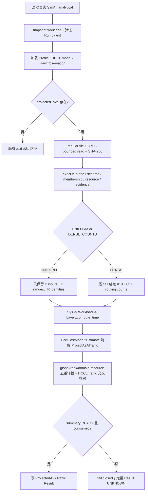
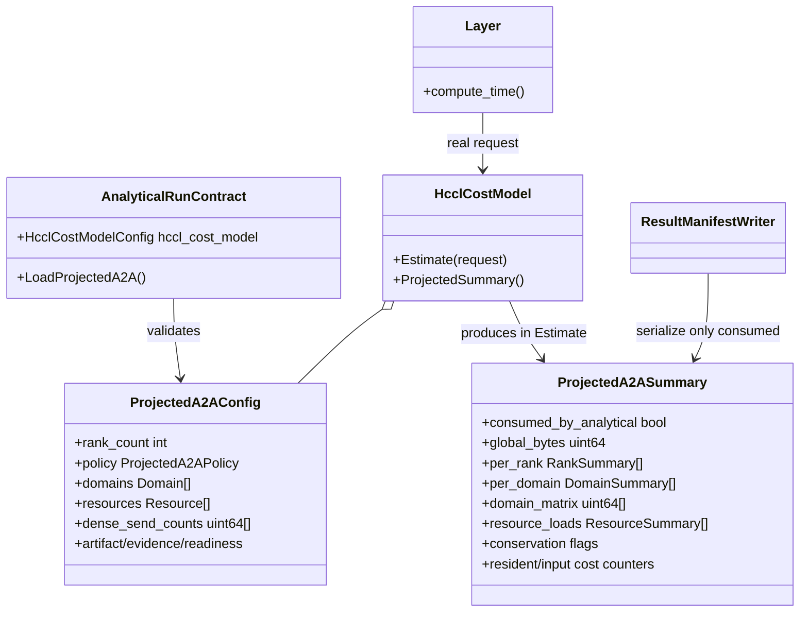

# Issue #20 — Projected A2A 大规模流量路径设计

## 1. 目标、边界与实施审计

本设计实现 `Projected A2A Traffic`：真实 `SimAI_analytical` 进程消费一个版本化、内容寻址的 routing artifact，经现有 `Layer -> CollectiveCostModel` 执行 seam 生成 global、rank、domain、resource 四个流量表面。它只用于 Analytical 聚合；不创建 endpoint flow，不代表 Simulation、NS-3 或 HCCL `CollectiveFlowProvider` 支持。

- `started_at`: `2026-08-18T22:42:06+0800`
- 分支/基线: `codex/issue-20` / `c83e3b5f28405c4b501f4eb37908135add3c60e6`
- TDD seam: 公共 `SimAI_analytical` 真实进程，以 Run Manifest 输入、Result JSON 输出观察行为。
- oracle: uniform/locality/hotspot 期望值来自测试中的独立 Python 枚举和固定 literal，不调用生产投影代码。
- skill: 已完整读取 `tdd`、`tests.md`、`mocking.md`；任务所称 `implement` skill 不在当前可用清单。
- 基线门禁: 写 #20 生产代码前，CMake glob/exclude 等价 62-source C++11 链接 PASS，既有真实进程 `108/108` PASS。
- 超时 profile: `profile-codex-session` 不可用，按仓库约定写 `profilecodex-20260818-230945.md`。
- 范围: 不实现 #22 held-out、#24 topology/placement、#28 Simulation flows 或 #29 smoke。

## 2. 4+1 架构视图

### 2.1 逻辑视图

新合同使用两个独立版本面：Run 中的 `simai.projected-a2a.request/v1alpha1` envelope，以及外部 artifact 的 `simai.ascend.projected-a2a.routing/v1alpha1`。它不修改、复用或放宽 #19 的 `simai.target.routing/v1alpha1`，也不修改 #18 的 `simai.ascend.routing/v1alpha1` A2AV schema。

uniform artifact 保存 rank count、连续且完备的 rank→domain ranges、per-rank API input bytes，以及两个抽象资源身份：`INTRA_DOMAIN`、`INTER_DOMAIN`。生产投影用闭式公式生成 `P` 个 rank summaries、`D²` 个 domain cells 和 `R` 个 resource summaries。任意 dense A2AV 使用独立 immutable JSON artifact，并逐 cell 绑定 #18 已经验证、实际被 HCCL provider 消费的 A2AV counts。

每次投影必须同时满足：

1. `global == sum(rank.send)`；
2. `global == sum(rank.receive)`；
3. `global == sum(domain_matrix)`；
4. domain matrix 每行等于该 source domain 的 send，每列等于 destination domain 的 receive；
5. `global == sum(resource.offered_load)`。

任一条件失败，provider 不产生 ready summary，HCCL request 失败，Result 不输出假定量值。

### 2.2 开发视图

- `ProjectedA2ATraffic.h/.cc`：无 JSON I/O 的 typed projector；包含 overflow-safe uniform/dense 计算、守恒、imbalance 和状态计数。
- `HcclCostModel.h/.cc`：在真实 `Estimate()` 内消费 projector；把投影 global 与 HCCL cost provider 的 traffic 再次交叉核对。`consumed_by_analytical` 只在这条执行路径设置。
- `RunContract.h/.cc`：regular-file/8 MiB bounded loader、SHA-256、exact schema、rank/domain membership、resource/evidence/readiness、dense HCCL cell binding；Result writer 只序列化已消费 summary。
- `test_analytical_run_contract.py`：全部 #20 验收从真实进程边界执行；测试不实例化 projector 或 mock `Layer/Sys/HcclCostModel`。
- `docs/design/issue-20-design.md`：合同、复杂度、典型流和 AC 证据。

### 2.3 进程视图



artifact 的 parse 时间在加载时测量，projection 时间在真实 `Estimate()` 调用内测量；两者被明确标为 observed timing，不进入内容寻址语义身份。rank 固定升序，domain/resource 保持声明顺序。

### 2.4 物理视图

实现只使用 CPU、普通文件和 C++11。projected artifact 必须是 `stat(2)` 认定的 regular file；`/dev/stdin`、FIFO、设备和不可读路径在解析前拒绝。最大 8 MiB；dense 的有效上限与 #18 A2AV gate 一致，为 256 ranks / 65,536 cells。所有 JSON integers 从原始 lexeme 精确解析并执行 `uint64_t` overflow gate。

uniform 常驻状态严格为：

```text
rank summaries          P
domain matrix cells     D²
resource summaries      R
dense routing cells     0
endpoint flow objects   0
total                    P + D² + R
```

dense bounded artifact 诚实报告 `P² + D² + R` 状态及 `P²` records read，不宣称任意 dense routing 有次二次输入成本。100,000-rank case 使用 100 domains 和 2 resources，状态为 `100,000 + 10,000 + 2 = 110,002`，表示 9,999,900,000 个有向 pair，但物化 0 个 endpoint flow。

### 2.5 场景视图（+1）

1. uniform：4 ranks、2×2 domains、400 B per-rank API input；每个非 self pair 为 100 B，global 1,200 B，rank send/receive 均 300 B，matrix `[[200,400],[400,200]]`，intra/inter 400/800 B。
2. locality dense：global 400 B，rank send/receive 均 100 B，matrix `[[150,50],[50,150]]`，intra/inter 300/100 B。
3. hotspot dense：rank receive `[0,220,140,40]`，matrix `[[70,130],[150,50]]`，intra/inter 120/280 B；hottest rank=1，max/mean=2.2。
4. 100k uniform：100×1,000-rank domains，message=100,000 B/per-rank，pair=1 B；global 9,999,900,000 B，diagonal cell 999,000 B，off-diagonal cell 1,000,000 B。
5. dense divergence：Projected matrix 与 #18 HCCL matrix global 相同但 cell 不同，加载阶段返回 `PROJECTED_A2A_DENSE_BINDING_MISMATCH`。
6. malformed/overlimit：non-regular、digest mismatch、invalid JSON、>8 MiB、unknown key、membership gap、unresolved evidence 均有独立稳定拒绝码。

## 3. 类图与职责



关键防伪约束是 writer 不接受 routing document、rank count 或 counts 作为计算输入；它只能读取 `HcclCostModel::ProjectedSummary()`。因此一个只通过 schema validator、未被 workload 的真实 collective request 消费的 projection 不能成为 READY Result。

## 4. Schema 与 Result 合同

Run envelope 只有两个 exact keys：

```json
{
  "schema_version": "simai.projected-a2a.request/v1alpha1",
  "routing": {"path": "...", "sha256": "sha256:..."}
}
```

artifact exact root 为 `apiVersion/kind/schemaSemver/metadata/spec`。`spec` 固定包含：`rankCount/domains/policy/resources/unit/evidenceRef/evidence`。domain ranges 必须按 rank 递增、无重叠无空洞地覆盖 `[0,P)`；resource 必须恰有一个 `INTRA_DOMAIN` 和一个 `INTER_DOMAIN` identity。uniform policy 只接受与 HCCL model exact message point 相同且可被 P 整除的 `messageBytesPerRank`。dense policy 接受 `LOCALITY/HOTSPOT/ARBITRARY`，但其 counts 必须与 #18 artifact 完全相同。

Result 的 `projected_a2a_traffic` 明确携带：

- capability：`backend=ANALYTICAL`、`endpoint_flows_materialized=false`、`simulation_flow_support=NOT_PROVIDED`；
- global/per-rank/per-domain/domain-matrix/resource load，规范单位均为 `B`；
- 六个 conservation flag（global 对 rank send/receive、domain matrix、resource load，以及 domain row/column）；
- hotspot imbalance；
- uniform represented/materialized pairs；
- resident state 与复杂度；
- artifact bytes、format、records、parse/projection time；
- routing/workload/profile/cost/topology provenance、evidence 和 readiness；
- deterministic ordering 与“observed timing 不属于 semantic identity”声明。

## 5. 典型程序运行流

调用者冻结 workload、Profile、RawObservation、DerivedCostModel 和 Projected routing 后，按 raw bytes 分别计算 SHA-256 并写 Run Manifest。入口先 snapshot workload，再有界加载四类 Ascend 资源；projected dense 还必须与已验证的 #18 counts 闭合。入口只把 typed config 注入 `HcclCostModel`。

`Sys` 读取相同 workload snapshot；`Layer::compute_time()` 构造真实 collective request。只有 request operation/ranks/message/topology 全部命中 HCCL model，`Estimate()` 才运行投影、检查守恒和 HCCL traffic 一致性并置 `consumed_by_analytical=true`。进程完成后 writer 输出 summary。若 workload 没有命中、出现第二个 request 或任一投影 gate 失败，则 `projected_a2a_traffic` 为 `UNKNOWN`，不会把预加载数据冒充执行结果。

## 6. ADR、AC 与测试映射

| 约束 / AC | 设计落实 | 真实进程证据 |
|---|---|---|
| ADR-0005：Analytical cost 与 Simulation flow 分离 | capability 固定 Analytical-only；0 endpoint flows | uniform 小例断言三字段；全回归保留 Simulation 未支持边界 |
| ADR-0006：Target resources 分离 | 新 schema 与 #19 v1alpha1 完全独立 | #19 unknown projection key guard 回归继续 PASS |
| ADR-0007：hierarchical projection | uniform 闭式 `O(P+D²+R)`；dense 诚实 `O(P²)` 输入 | 4-rank 与 100k 状态计数断言 |
| global/rank/domain/resource 输出 | typed summary 的六个表面 | uniform/locality/hotspot literal ground truth |
| 每次投影守恒 | global 四重总和 + domain row/column | 三小例与 100k `status=PASS` |
| uniform 无 O(P²) resident flows | dense cells=0、flows=0、pair materialized=0 | 100k black-box |
| dense immutable/stream 成本 | 仅 regular immutable JSON；8 MiB/256-rank；bytes/records/timing | locality/hotspot + boundary matrix |
| provenance/readiness | artifact/profile/model/workload/topology digest 与 evidence | Result/evidence/readiness 断言 |
| 100,000-rank 受控资源 | timeout 60s、Result <32 MiB、RSS/wall 外部测量 | `test_projected_uniform_100000_rank_real_process_has_bounded_state` |
| 防溢出/伪 READY | exact integer、checked add/multiply、exact schema/evidence | malformed/binding/limit 真实进程负例 |

## 7. TDD 记录与验证证据

| slice | RED | GREEN |
|---|---|---|
| uniform | Result 缺 `projected_a2a_traffic` | global/rank/domain/resource/守恒与 10 resident entries |
| locality | 缺 `artifact_format` | dense 16 records、locality matrix/resource ground truth |
| hotspot | 缺 `imbalance` | hottest rank/max/mean=2.2 |
| resident honesty | 缺 `resident_dense_routing_cells` | uniform=0/O(P+D²+R)，dense=16/O(P²+D²+R) |
| 100k | 缺 `uniform_closed_form` | represented 9,999,900,000/materialized 0 |
| dense binding | divergent cell matrix 被接受 | exact HCCL/Projected cell binding fail closed |
| domain conservation | 缺 row/column flags | 每 domain 行列守恒参与 READY gate |
| determinism contract | 缺 `determinism` | 固定排序/content-addressed/observed timing 声明 |

已取得的安全点证据：baseline 62-source C++11 link PASS、108/108；新增后 63-source C++11 link PASS，耗时 14.77 s、最大 RSS 214,106,112 B，二进制 SHA-256 为 `648b2baf8b32ef0f56ecf75ab3f3624c30500c3ceabd3906a4bcdcf481711c68`；新增三模块 strict compile PASS（RunContract 只定向豁免上游 header 的既有 unused parameters）；完整真实进程 113/113 PASS，耗时 39.609 s、外部最大 RSS 124,223,488 B。

100,000-rank 独立真实进程退出码为 0：projection 进程 wall 0.27508245781064034 s，外部 `/usr/bin/time` wall 0.37 s、最大 RSS 75,218,944 B，Result 7,892,501 B；输出 100,000 rank summaries、10,000 domain cells、2 resource summaries、110,002 resident state units、0 dense cells、0 endpoint flows，并以闭式表示 9,999,900,000 个 directed pairs。六个守恒布尔项均为 true，状态为 PASS。

最终静态门禁：独立 Python 枚举 oracle 对 uniform/locality/hotspot/100k 全部 PASS；24 个 fixture 均可解析；`git diff --check`、敏感信息扫描、#22/#24/#28/#29 scope 扫描均 PASS。uniform fixture SHA-256 为 `694faf7539a9407d1caac8e3675933cba90899e51873b77d293e453f3c539dae`。

## 8. 限制与后续依赖

- 两个资源 scope 是 #20 的可审计抽象 offered-load identity，不是 #24 的物理 topology path、placement、capacity 或 completion-time bottleneck。
- `FIELD_UNVERIFIED` synthetic evidence 可以证明合同、守恒和排序，但不是 measured HCCL performance；readiness 与 evidence level 分开输出。
- observed parse/projection time 是进程资源证据，天然不属于内容寻址 semantic identity；其单位和含义显式报告，不用于 routing digest。
- dense JSON 是本票的 bounded immutable artifact 方案；不声称 arbitrary P² 输入具有次二次读取成本。未来 routing stream 必须另起版本、保留同等 digest/record/time/limit 证据。
- Simulation 必须等待 #28 独立 HCCL `CollectiveFlowProvider`；Projected summary 永远不能作为 endpoint packet/flow list。
