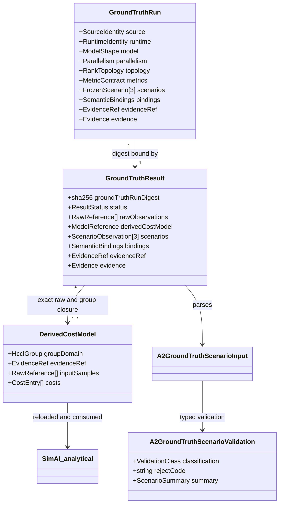
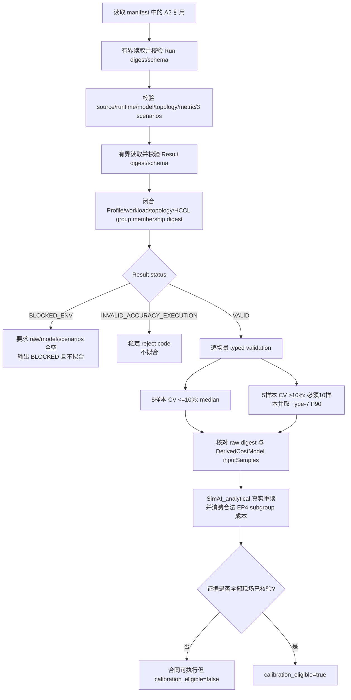

# Issue #21 — A2 Ground Truth 与校准闭环设计

## 1. 目标、边界与实施审计

本设计为冻结的 reduced MoE A2 校准建立四个内容寻址对象：`GroundTruthRun`、
`GroundTruthResult`、`RawObservation` 与 `DerivedCostModel`。只有来源、运行时、拓扑、
指标、样本和证据全部闭合后，模型才能成为真实校准输入；synthetic fixture 只验证
合同、统计与重读链路，不构成 A2 Ground Truth。

- `started_at`: `2026-08-18T19:57:18+0800`
- `review_fix_started_at`: `2026-08-18T21:03:54+0800`
- `branch`: `codex/issue-21`
- `base`: `e2da4ac8f8e4ec723ba1ef1c0e441bfbc0ab7ff6`
- `tdd`: 完整读取并采用 `tdd` skill；新增行为均经过公共真实进程 seam 的 RED → GREEN。
- `implement_skill`: 当前可用 skill 清单中不存在，未声称使用。
- `remote_lock_contract`: 所有 NPU、驱动、训练或采样探针均由完整远端命令持共享锁，
  等待上限 7200 秒；未只锁子步骤。
- 当前环境判定：`BLOCKED_ENV/A2_HCCL_ABI_UNAVAILABLE`。硬件可见，但冻结运行时、
  HCCL ABI 与完整源码身份尚不能同时核验，因而没有执行训练、没有生成实测模型。
- 明确不实现 #22 held-out gate、#23 A5 profile、#20 projected routing 或 #28 simulation。

## 2. 4+1 视图

### 2.1 逻辑视图

`GroundTruthRun` 冻结“要运行什么”，`GroundTruthResult` 绑定“实际观察到什么”；
每个 raw 引用都由 SHA-256 约束，`DerivedCostModel.inputSamples` 必须逐项复述相同的
raw digest。`SimAI_analytical` 重读并实际使用该模型，而不是只验证文件存在。

### 2.2 开发视图

- `A2GroundTruth.h/.cc`：不做 JSON 或文件 I/O 的 typed validator/statistics 模块；
  负责 5/10 样本规则、样本 CV、中位数、Type-7 P90、峰值 HBM 与异常分类。
- `RunContract.h/.cc`：执行有界 JSON 解析、精确 schema、SHA-256、引用闭包、证据/
  readiness、Profile/workload/topology/HCCL subgroup 语义闭包和 Analytical 模型重读；
  输出结构化结果。A2 v0.2 Profile evidence index 与 raw/model schema 对根对象及受控
  嵌套对象都执行 exact-key、type 与 enum 校验。Profile 的每个 consumed field/topology
  引用都唯一解析到完整 evidence record；`FIELD_VERIFIED` 只接受
  `MEASURED/FIELD_VERIFIED/hardwareAvailable=true`，整体证据属性从实际被引用集合聚合，
  不读取未引用首记录作为捷径。
- `tests/contract/fixtures/a2_ground_truth_*_synthetic.json`：三场景冻结合同，合同级
  evidence 为 `USER_INPUT/FIELD_UNVERIFIED` 且 `hardwareAvailable=false`，因此三个场景
  均继承 FIELD_UNVERIFIED，绝不升级真实远端 readiness。
- `docs/evidence/issue-21-a2-blocked-env.json`：三次脱敏诊断探测、一个独立认证失败记录及
  最低修复；认证失败的原始时间未留存，明确标记为 retrospective record，未伪造重跑
  或时间。其 SHA-256 由同目录摘要文件固定为
  `23b58d3592d6f165eb9c789a78770e362db2e556ece8fc13fa44e31a0af5ce34`。
- `docs/evidence/issue-21-a2-probe-contract.json`：版本化检查集合、30 秒超时、稳定结果码
  与脱敏输出策略；其 SHA-256 为
  `a4095cc860459530d1497ee247a06947c423cfc0374f7b092a0975675190f135`。

### 2.3 进程视图

### 2.4 物理视图

冻结目标为单个 A2 域的 8 个训练 rank，每设备 1 rank；并行度 TP=1、PP=2、EP=4、
DP=4。rank mapping 以 digest 固定。示例通信点绑定合法 EP subgroup `rank 0..3`，不是
4-rank world 或 TP group；group id、kind、members 与 topology digest 共同形成 membership
digest，并由 Run、Result、raw 与 model 逐项复述。真实执行前还必须核验 TorchNPU/CANN/driver/HCCL
ABI，任何缺口都只能输出 `BLOCKED_ENV`。公共证据不包含主机、账号、地址、凭据、
访问命令或宿主路径。

### 2.5 场景视图（+1）

典型 synthetic 流：调用者提交 FIELD_UNVERIFIED Run/Result；balanced 与 long 的 5 次
低 CV 走中位数，communication-heavy 的首 5 次 CV 大于 10%，10 次样本按 Type-7
得到 P90=141000000ns；raw digest 与模型输入闭合后，真实 `SimAI_analytical` 重读
EP subgroup 成本并得到 61943ns。最终 `calibration_eligible=false`，因为 synthetic evidence 不是
现场测量。

典型 blocked 流：Result 为 `BLOCKED_ENV` 时，只允许受控 reason/remediation，且
`rawObservations=[]`、`derivedCostModel=null`、`scenarios=[]`；真实进程返回阻断码，
readiness 不会升级。

合同门禁正例流只用于证明门可达：Run=`USER_INPUT/FIELD_VERIFIED`、Result/Profile/raw=
`MEASURED/FIELD_VERIFIED`、model=`DERIVED/FIELD_VERIFIED`，五类对象均要求
`hardwareAvailable=true`、非空 `evidenceRef`，且 Profile/workload/topology/group 的内容
摘要完全闭合，真实进程才返回 `calibration_eligible=true`。该正例由 synthetic fixture
派生，仅验证合同，不宣称已经取得 A2 Ground Truth。

## 3. 冻结合同

### 3.1 身份、模型与拓扑

| 项 | 冻结值 |
|---|---|
| MindSpeed-LLM | `2b7130ca7bea7083a91ed66812eec95067d057a2` |
| MindSpeed | `81570f17ee091e783fa68428c04fa536da122dc1` |
| Megatron-LM | `a845aa7e12b3a117e24c2352b9e3e60bad2e3a17` |
| Runtime | Python 3.10 / PyTorch 2.7.1 / TorchNPU 7.3.0 / CANN 8.5.0，另含 driver 与 ABI digest |
| Reduced MoE | 4 active layers / E32 / TopK16 / expert width 3072 / shared expert 1 / MBS 1 |
| Parallelism | TP1 / PP2 / EP4 / DP4 / world size 8 / one rank per device |

### 3.2 三个冻结场景

| 场景 | sequence tokens | GBS | GA | configured global tokens |
|---|---:|---:|---:|---:|
| `A2-CAL-BALANCED` | 2048 | 8 | 2 | 16384 |
| `A2-CAL-COMM` | 1024 | 16 | 4 | 16384 |
| `A2-CAL-LONG` | 4096 | 8 | 2 | 32768 |

### 3.3 指标与统计

- step time 与 HCCL observation 使用 `ns`，peak/base HBM 使用 `B`，warmup 排除。
- 初始恰好 5 次；前 5 次样本 CV > 0.10 时必须扩到恰好 10 次，否则保持 5 次。
- 高变异代表值采用线性插值 Type-7 P90；其余采用中位数。
- Type-7 P90 的位置固定为 `(n-1)*9/10`，以 quotient/remainder 的 `uint64_t` 有理数
  插值及整数舍入实现；不经过 `long long`/`llround`，包括 `UINT64_MAX` 仍保持精确。
- peak HBM 达到 base HBM 的 85% 即无效；typed 层以 quotient/remainder 计算
  `ceil(base_hbm_B * 17 / 20)`，不执行可能溢出的乘法，覆盖 `UINT64_MAX` 边界。
- 数组必须是完整的 5 或 10 组配对样本；拒绝零值、非整数、越界、重复键、未知键、
  非法单位或不闭合 digest。step time 的 canonical typed 单位为 `uint64_t ns`；JSON
  边界拒绝 float/NaN，typed 层拒绝零值并断言 CV/统计结果有限，非有限浮点不能通过
  narrowing 编译 seam 进入 typed 层。

## 4. 状态、异常与 readiness

| 条件 | 状态/稳定码 | 是否拟合 |
|---|---|---:|
| OOM | `INVALID_ACCURACY_EXECUTION/A2_OOM` | 否 |
| peak HBM >= 85% | `INVALID_ACCURACY_EXECUTION/A2_HBM_LIMIT_REACHED` | 否 |
| rank loss | `INVALID_ACCURACY_EXECUTION/A2_RANK_LOSS` | 否 |
| loss/gradient non-finite | `INVALID_ACCURACY_EXECUTION/A2_NON_FINITE` | 否 |
| token loss | `INVALID_ACCURACY_EXECUTION/A2_TOKEN_LOSS` | 否 |
| token replay | `INVALID_ACCURACY_EXECUTION/A2_TOKEN_REPLAY` | 否 |
| provenance drift | `INVALID_ACCURACY_EXECUTION/A2_PROVENANCE_DRIFT` | 否 |
| 合法运行态 OOM/HBM/rank/non-finite/token loss/token replay/provenance drift | `INVALID_ACCURACY_EXECUTION/<七种精确 subtype>` | 否 |
| 样本不是5或10组 | `INVALID_INPUT/A2_GROUND_TRUTH_SAMPLE_COUNT_INVALID` | 否 |
| 违反5/10 CV规则 | `INVALID_INPUT/A2_GROUND_TRUTH_SAMPLE_RULE_VIOLATION` | 否 |
| malformed float/type/unknown key | `INVALID_INPUT/<稳定 schema code>` | 否 |
| 环境/ABI缺失 | `BLOCKED_ENV/A2_HCCL_ABI_UNAVAILABLE` | 否 |

只有 Run=`USER_INPUT/FIELD_VERIFIED`、Result/Profile/raw=`MEASURED/FIELD_VERIFIED`、
model=`DERIVED/FIELD_VERIFIED`，五类对象 hardware/evidenceRef 均有效且所有内容及语义
digest 闭合时才允许 calibration eligible。synthetic 的 VALID 只表示合同与统计自洽，
不表示现场校准有效。

## 5. ADR、AC 与测试映射

| 约束/AC | 设计落实 | 自动化证据 |
|---|---|---|
| ADR-0001/0003：有效性优先、证据分层 | 异常永不拟合；evidence/readiness 双门 | invalid matrix、unverified eligibility 真实进程测试 |
| ADR-0005：原始数据与成本模型可追溯 | Run/Result/profile/workload/raw/model 全部 SHA-256；inputSamples 与 subgroup 闭包 | digest/group/profile/workload mismatch、模型重读测试 |
| ADR-0006：A2/A3 来源字段 | 三源码 commit + runtime/driver/ABI | frozen contract exact-schema 测试 |
| ADR-0007：统一校准语义 | 固定单位、上限、稳定状态码 | invalid、bounds、unit 测试 |
| ADR-0008：不可越过门禁 | 五类 evidence 的 FIELD_VERIFIED 链路才可 eligible | verified 正例与 synthetic 不升级 readiness 真实进程测试 |
| Profile evidence 解析 | v0.2 exact index；聚合实际 consumed refs | 未引用首记录攻击、evidence/source unknown-key 真实进程测试 |
| 三场景冻结 | 精确 ID/sequence/GBS/GA/GTS 与 4/E32/TopK16/3072 | full real-process contract 测试 |
| 5/10 + CV + Type-7 P90 | typed statistics module | P90=141000000ns 与 `UINT64_MAX` 独立 typed oracle |
| BLOCKED_ENV 可操作修复 | 空 raw/model/scenarios + 最低修复 | blocked payload 真实进程测试 |
| 真实 Analytical 消费 | 加载 DerivedCostModel 且携 raw digest/合法 EP4 subgroup | 输出 timing=61943ns 的真实进程测试 |

本地验证按 CMake glob/exclude 得到 62 个源文件并完成真实链接；测试总数为 108。
真实 A2 环境尚未满足 L0，因此本交付状态是
`READY_FOR_REREVIEW_WITH_BLOCKED_ENV`，不是 Issue 完成或 Ground Truth READY。

## 6. 当前外部阻断与最低修复

三个已记录时间的连续脱敏诊断探测均确认硬件存在，但目标 Python/TorchNPU lane、冻结
MindSpeed-LLM checkout 与 CANN/HCCL ABI 身份不完整。最低修复为：提供干净隔离的
Python 3.10 + PyTorch 2.7.1 + TorchNPU 7.3.0；提供三个冻结源码 checkout；暴露匹配
CANN 8.5 的 HCCL runtime 与 ABI digest；随后重新执行带锁的 L0 import、BF16
correctness 和 8-rank domain formation。完成这些条件前不得运行训练或把 synthetic
数据表述为真实 A2 Ground Truth。另一个配置记录认证失败；原探测未保留可发布时间，
故只作为独立 retrospective attempt 保存，不计入三次连续的带时间诊断，也不伪造重跑。
