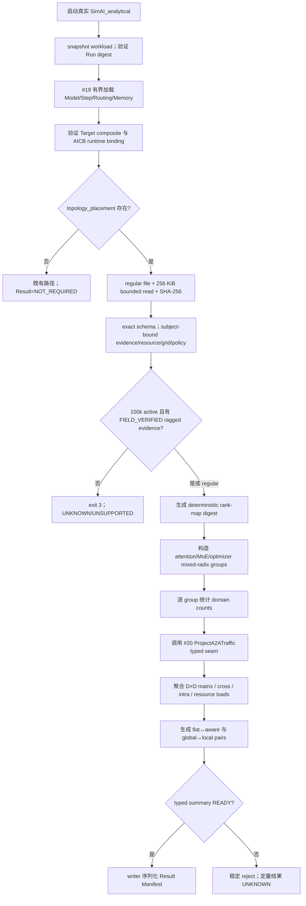
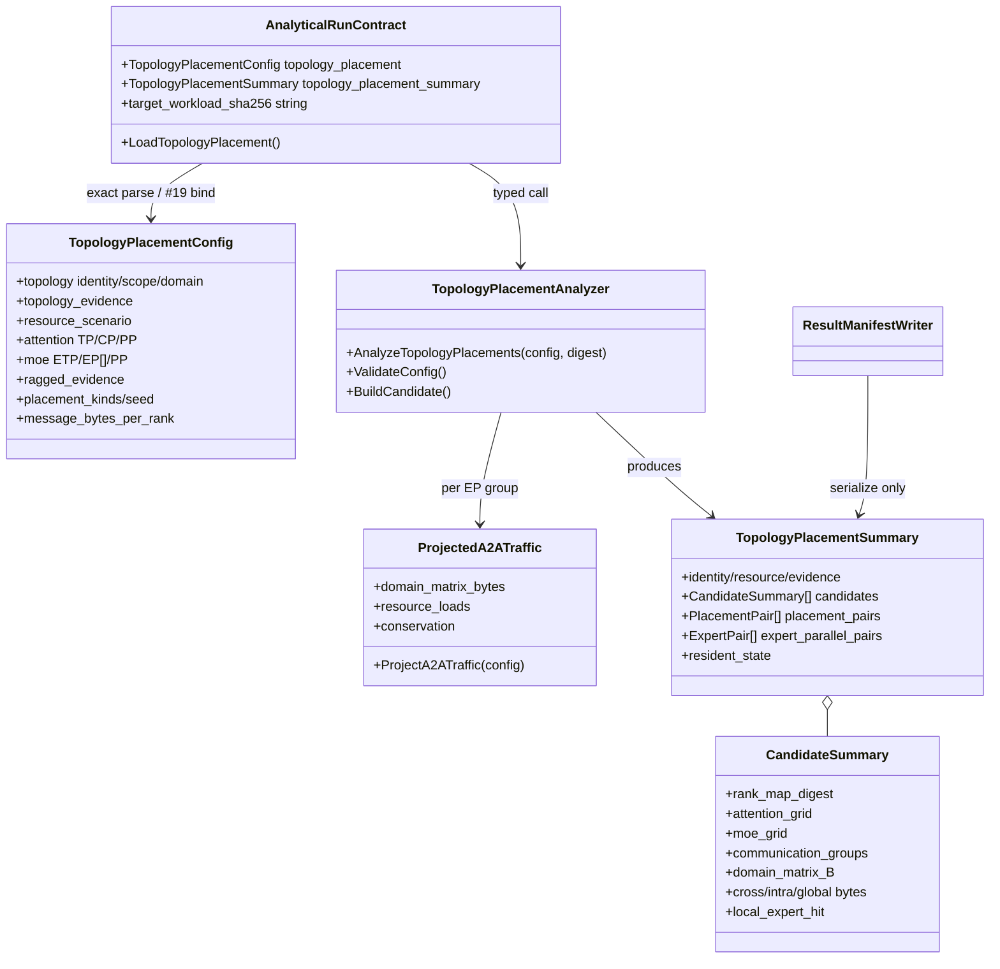

# Issue #24 — 100k 拓扑、资源场景与成对放置分析设计

## 1. 目标、范围与实施审计

本设计实现 [Issue #24](https://github.com/Kirrito-k423/SimAI-Ascend/issues/24)，父规格为
[Issue #15](https://github.com/Kirrito-k423/SimAI-Ascend/issues/15)，并复用 #19 的 10T
Target Workload 内容身份以及 #20 的 `ProjectedA2A` typed projector。唯一公共 seam 是：

```text
simai.run/v1 -> real SimAI_analytical process -> simai.result/v1
```

本票在该进程内做 traffic-only 放置分析：分别建立 current-product 1,024-rank
SuperPod 和 architecture-limit 8,192-rank SuperNode 身份；显式区分 98,304 regular、
100,000 exact ragged 和 100,352 product-capacity 三种资源语义；生成 flat/random 与
topology-aware、global EP=2048 与 local EP=1024/512+EDP 的成对候选，并输出可审计的
rank-map/group digest、domain matrix、跨域字节、local-expert-hit 与共享资源负载。

- `started_at`: `2026-08-19T00:12:26+0800`
- 分支/固定基线: `codex/issue-24` / `7e6da24e6e59fade6962c2fdb2de1aff3c6bd648`
- TDD seam: 每个 RED/GREEN 都启动真实 `SimAI_analytical`，写 Run Manifest 并只观察
  Result Manifest/退出码；测试不直接调用生产 analyzer。
- baseline: 写生产代码前，CMake glob/exclude 等价 63-source C++11 全链接 PASS，
  既有真实进程回归 `114/114` PASS。
- review-fix: 固定原实现 `536853f5b9a2dabe330e3d1df3b6425cce1c9479`，开始于
  `2026-08-19T01:26:48+0800`；六项 finding 均先用旧 binary 固化真实进程 RED，再做
  最小 GREEN；结束于 `2026-08-19T02:08:11+0800`，wall-clock `41m23s`。
- skill: 已完整读取并遵循 `tdd` 和 `code-review`；任务提及的 `implement` skill 不在
  当前可用列表，未伪称使用。
- 超时 profile: `profile-codex-session` 不可用，使用
  `profilecodex-20260819-004145.md` 记录真实耗时原因。
- 运行环境: CPU-only；没有执行 NPU、远端命令或锁等待。
- 范围排除: 不实现 #25 candidate search/ranking、#28 Simulation flow、#29 16-rank
  smoke，也不把 traffic bytes 伪装成 completion time。

## 2. 4+1 架构视图

### 2.1 逻辑视图

Run Manifest 可选携带一个 exact `topology_placement` envelope，引用最大 256 KiB 的
regular JSON artifact。artifact 必须绑定已由 #19 验证的 Model/Step/Routing/Memory
四资源 composite digest。输入中的 topology identity 与 topology evidence 是两个独立
字段集合；任何一个身份都不能借用另一个身份的 evidence、domain size 或 digest。

资源三元组固定为：

| scenario | active | capacity | spare | domain semantics |
|---|---:|---:|---:|---|
| `REGULAR_98304` | 98,304 | 100,000 | 1,696 | 1,024: 96 full；8,192: 12 full |
| `EXACT_100000_RAGGED` | 100,000 | 100,000 | 0 | 1,024: 97 full + 672；8,192: 12 full + 1,696 |
| `PRODUCT_CAPACITY_100352` | 100,000 | 100,352 | 352 | 仅 current-product；97 full + 672 active |

每个候选同时证明两个不同的并行网格：

```text
attention: N = TP × CP × DP × PP
MoE:       N = ETP × EP × EDP × PP
```

二者分别校验，不能用 attention DP 代替 MoE EDP。Target Workload 的 routed experts 必须
精确为 2,048，且每个 EP 必须整除 2,048。regular candidate set 必须精确覆盖
`[128, 256, 512, 1024, 2048]`。100,000 不是这些 EP 的整倍数，因此 exact/product lane
只有在 artifact 携一条绑定目标框架 source revision/content digest，并逐项证明 non-uniform
process group、tensor shard、expert shard、optimizer-state semantics 的
`SOURCE_CODE_AUDIT/FIELD_VERIFIED` evidence 时才 READY；缺失时结果为
`UNKNOWN/UNSUPPORTED`。通用 evidence record、`USER_INPUT/LEGACY_ASSUMED`、无关
source/method 或 `hardwareAvailable=false` 都不能升级 readiness。

每种 placement 用一个无需常驻 rank vector 的确定性双射表示：topology-aware 是 identity
rank order；flat/random 是版本化 `AFFINE_DOMAIN_MIXING_PRP_V2`，其 normalized
multiplier 与 active-rank count 互素、拒绝 ±1，并保证足以跨 topology domain 的最小
stride，Result 同时输出 multiplier/offset。每个 MoE EP group 按
`ETP×EP×EDP×PP` mixed-radix membership 构造，再经过 rank map 映射到物理 topology
domains。每个 group 只生成 domain rank counts，传给 #20
`ProjectA2ATraffic`；输出聚合到 candidate 的 `D×D` matrix。生产代码从不创建 endpoint
pair/flow，也不保留 `P²` 状态。

### 2.2 开发视图

- `TopologyPlacement.h/.cc`：无 JSON/file I/O 的 C++11 typed analyzer；负责 identity/
  resource/grid/ragged gate、rank mapping、group canonical digest、调用 #20 projector、
  traffic 聚合及两类 pair delta。
- `RunContract.h/.cc`：复用现有 SHA-256、bounded artifact loader、exact JSON/evidence
  parser 和 #19 composite identity；把解析后的 typed config 交给 analyzer；Result writer
  只序列化 analyzer summary。
- `ProjectedA2ATraffic.h/.cc`（#20，未修改）：每个 communication group 的唯一 traffic
  计算 seam，提供 global/domain/resource 守恒结果。
- `test_analytical_run_contract.py`：从真实进程验证三个资源情景、两种 topology identity、
  十个 regular candidates、独立枚举 oracle、稳定拒绝码、determinism 和资源上界。
- `docs/design/issue-24-design.md`：冻结合同、4+1、复杂度、证据/readiness 与后续边界。

### 2.3 进程视图



artifact 解析发生在构造实际 `Sys` 前；合法 Target Workload 随后仍进入既有真实 runtime。
Topology analyzer 是同一进程中的 typed traffic-only 分析，不是 writer 的派生 JSON，也
不是 #28 的 network simulation。writer 不接受原始 topology document 或 rank assignments
作为计算输入，因此不能在没有 typed READY summary 时伪造矩阵或命中率。

### 2.4 物理/部署视图

实现只需要本地 CPU、普通文件、C++11 和现有 Analytical binary。输入 path 在输出中不
回显；Result 只含 content digest、受控 identity/evidence、整数 traffic 和固定枚举。
topology artifact 用一次 `open(O_NOFOLLOW|O_NONBLOCK)` 取得 descriptor，并在同一
descriptor 上 `fstat` 后做 `max+1` bounded read；不会发生 path `stat` 后重新打开的
TOCTOU。symlink、FIFO 和设备 fail-closed，读取上限为 256 KiB，摘要在 JSON 解析前验证。
不存在网络、NPU、CANN、HCCL 设备 ABI 或远端依赖。

设 active ranks 为 `P`、topology domains 为 `D`、候选数为 `C=10`、某 folded MoE
grid 的非空 EP slices 为 `G`。实现的资源上界是：

```text
输入 artifact                         O(1)，<= 256 KiB
单 rank-map canonical transient       O(P)，每种 placement 依次释放
单 ProjectedA2A rank transient        O(EP)，最大 2,048
单 ProjectedA2A domain matrix         O(D²)，最大 98²
Result candidate matrices resident    O(C×D²)
endpoint flows / dense pair records   0
总计算                                O(C×(P + G×D²))
```

代码中的 checked add/product、message divisibility 与 signed delta gate 阻止溢出或截断；
无界 EP/factor、非法 matrix shape 或 projector conservation failure 都不能进入 READY。

### 2.5 场景视图（+1）

1. current regular：98,304 active、96×1,024 domains；EP128/256/512/1024 的
   topology-aware groups 均 domain-local，EP2048 跨两个 SuperPod；flat/random 提供相同
   workload/active count 的配对反事实。
2. architecture regular：同样 98,304 active，但 topology identity、evidence、digest 和
   8,192-rank domains 完全独立；输出 12 full domains，绝不复用 current-product identity。
3. exact no evidence：100,000 active 需要 ragged groups；缺目标框架证据返回 exit 3、
   `EXACT_RAGGED_FRAMEWORK_CAPABILITY_REQUIRED` 和 `UNKNOWN/UNSUPPORTED`，不输出默认矩阵。
4. exact verified：100,000/100,000/0，current topology 为 97 full + 672 active；默认
   ETP/PP=1 时每个 EP 输出其 full groups 和 `[32,160,160,672,1696]` partial group
   ranks，并分别给出 attention/MoE full-grid product 与 remainder。
5. product capacity：100,000/100,352/352，只允许 current-product topology；同一 active
   placement 与 capacity/spare 身份分开报告。
6. paired contrasts：每个 EP 输出 flat↔aware delta；每种 placement 输出 EP2048 与
   EP1024/512+EDP 的 cross-byte/local-hit delta，未做 #25 排名。
7. malformed：unknown key、digest mismatch、non-regular、>256 KiB、identity/domain mismatch、
   illegal EP/grid/message、evidence mismatch 和 target binding mismatch 均有稳定拒绝码。

## 3. 类图与职责



## 4. 输入与输出合同

### 4.1 Run envelope 和 artifact

Run envelope 以及其中 artifact reference 都是 exact-key 合同；reference 在任何 I/O 前只
允许 `{path,sha256}`：

```json
{
  "schema_version": "simai.topology-placement.request/v1alpha1",
  "artifact": {"path": "...", "sha256": "sha256:..."}
}
```

artifact 使用 `simai.ascend.topology-placement/v1alpha1`，root 固定为
`apiVersion/kind/schemaSemver/metadata/spec`。`spec` exact 包含：

- `targetWorkloadSha256`：必须等于 #19 已验证 composite；
- `topology`：identity/scope/domainSizeRanks/evidenceRef/evidence；
- `resourceScenario`：kind/spareSemantics；
- `parallelSpace.attention` 与 `parallelSpace.moe`：两个独立 grid；
- `frameworkCapabilities.raggedParallelGroups`：`NOT_PROVIDED` 或带一条
  `FIELD_VERIFIED` evidence 的 `SUPPORTED`；
- `placementPolicies`：精确顺序 `[FLAT_RANDOM, TOPOLOGY_AWARE]` 和 uint64 seed；
- `traffic`：`HCCL_ALLTOALL_TOTAL_SEND_BYTES`、positive bytes/rank、单位 `B`。

topology identity 与 ragged framework 使用两个不同的专用 exact schema，不接受未知 key、
断开的 `evidenceRef` 或通用 evidence 升级。topology claim digest 绑定
identity/domain/source revision/source digest；ragged claim digest 绑定目标框架、source
revision/content digest 和四项能力布尔值。两个 schema 都要求唯一 record、允许的
class/method、`FIELD_VERIFIED` 与 hardware closure。测试中的 `fixture://` record 只是
synthetic contract fixture，不构成 NPU 实测或公开产品性能主张。

### 4.2 Rank map 与 communication groups

每个 placement 的 rank-map digest 来自完整 canonical `logical:physical` 序列；Result 不
驻留该序列，而是输出 algorithm、seed、normalized multiplier/offset 与 digest。
communication groups 使用 `MIXED_RADIX_FORMULA_V1`，固定输出
`ATTENTION_TP/CP/DP/PP`、`MOE_ETP/EP/EDP/PP`、`OPTIMIZER_DP/EDP` 十个 axis。
每项都携 membership formula、regular axis size、covered ranks、full-grid product、ragged
tail 和 digest；candidate 的 factors、active world、rank-map digest、target digest 与公式
共同进入 digest。因此消费者可由 Result 独立重建 memberships 并复算 digest，无需输出
100,000 项 rank array 或 endpoint pair list。

### 4.3 Result Manifest

`results.topology_placement_analysis` 在 READY 时携带：

- `capability`: Analytical、`PROJECTED_A2A_TYPED`、0 endpoint flows、Simulation
  `NOT_PROVIDED`；
- topology identity/digest/evidence 与 resource active/capacity/spare/domain breakdown；
- ragged target-framework state/evidence；
- 两套 grid 公式与 regular EP coverage；
- 十个 candidates：rank map、group digests、完整 `D×D` bytes、global/cross bytes、
  local expert hit、INTRA/INTER shared resource loads；
- 五个 flat↔aware pairs，以及四个 global EP2048↔local EP1024/512+EDP pairs；
- resident/transient 上界、deterministic ordering 与 content-addressed provenance。

不 READY 时只输出 capability、`UNKNOWN/UNSUPPORTED` 与稳定 reject code，不写零值或默认
矩阵。顶层 `readiness.topology_placement` 同步为 `READY/UNKNOWN`。

## 5. 典型程序运行流程

调用者先冻结 #19 四资源和 AICB workload，计算 composite digest；然后构造 topology
artifact，把同一 composite 写入 `targetWorkloadSha256`，对 artifact raw bytes 计算
SHA-256 并加入 Run Manifest。入口首先按 #19 路径验证工作负载，随后对 topology envelope
做 exact shape gate，再以同一个 fd 完成 `open/fstat/max+1 read` 和 digest check。

schema/evidence 通过后，loader 构造 `TopologyPlacementConfig`。typed analyzer 解析固定
resource semantics；TP 必须为 power-of-two 且整除 #19 hidden size，ETP 必须为
power-of-two 且整除 #19 expert intermediate size。regular 对完整 attention/MoE
denominator 无条件整除；exact/product 的任一 remainder 都需要上述 ragged evidence。
随后推导 DP/EDP、domain counts 和 ragged tail。每个 placement 先计算一次完整 rank-map digest；
每个 EP candidate 再按 group 统计 domain counts并调用 #20 projector。projector 的 global/
matrix/resource conservation 不通过时 analyzer 整体失败。

全部十个 candidate 完成后，analyzer 从同一 summary 找到配对对象并计算 signed byte
delta/local-hit；缺任一 candidate 都稳定拒绝。合法 Target Workload 随后仍进入真实
`Sys -> Workload -> Layer` 路径。进程结束时 writer 只读 typed summary 并输出 Result。
任何输入、evidence、算术或 projector gate 失败都会阻断 quantitative output；不存在“先
写默认数值、再标 UNKNOWN”的路径。

## 6. Fail-closed、证据与稳定状态码

| gate | stable result |
|---|---|
| exact active 缺 ragged capability evidence | exit 3 / `EXACT_RAGGED_FRAMEWORK_CAPABILITY_REQUIRED` |
| topology subject/evidence/claim 不闭合 | `TOPOLOGY_IDENTITY_EVIDENCE_INVALID` |
| topology identity/scope/domain 不闭合 | `TOPOLOGY_IDENTITY_SEMANTICS_INVALID` |
| architecture identity 用 product-capacity | `PRODUCT_CAPACITY_TOPOLOGY_NOT_APPLICABLE` |
| TP 非 power-of-two 或不整除 hidden size | `ATTENTION_TP_SHARD_INVALID` |
| ETP 非 power-of-two 或不整除 expert width | `MOE_ETP_SHARD_INVALID` |
| regular attention/MoE 完整 product 不整除 active | `REGULAR_*_GRID_NOT_DIVISIBLE` |
| EP 不整除 2,048 experts | `EP_NOT_DIVISOR_OF_ROUTED_EXPERTS` |
| regular EP set 不完整/乱序 | `REGULAR_EP_COVERAGE_INCOMPLETE` |
| MoE factor 非法/溢出/大于 active world | `MOE_GRID_INVALID` |
| per-rank message 不能均匀投影完整/尾 group | `PLACEMENT_TRAFFIC_MESSAGE_NOT_DIVISIBLE` |
| topology/ragged evidence ref 不闭合 | `*_EVIDENCE_INVALID` |
| #19 composite 不匹配 | exit 3 / `TOPOLOGY_PLACEMENT_TARGET_WORKLOAD_REQUIRED` |
| unknown artifact reference key（I/O 前） | `TOPOLOGY_PLACEMENT_REFERENCE_INVALID` |
| symlink/FIFO/device/digest mismatch/>256 KiB | 独立 `TOPOLOGY_PLACEMENT_*` code |

这里的 `READY` 表示输入足以重现 traffic-only summary。它不意味着 topology 性能已由 NPU
现场核验，也不意味着目标训练框架真的支持 ragged；exact lane 只能依据明确、绑定的目标
框架 evidence 进入 READY。

## 7. ADR、验收标准与测试映射

| 约束 / AC | 实现 | 真实进程/独立证据 |
|---|---|---|
| ADR-0010 identity 分离 | 1,024 current 与 8,192 architecture 各自 identity/scope/evidence/digest | 两进程断言 digest/ref 不同及 domain 96/12 |
| 三种资源语义 | typed 固定三元组，product 只允许 current | regular + exact + product Result exact equality |
| attention/MoE 独立 grid；EP｜2048 | 完整 denominator、mixed-radix DP/EDP、#19 shard binding | TP=3、ETP=3、regular denominator 负例；ETP=2/PP=2 独立 oracle |
| regular EP 128..2048 | exact ordered coverage、两 placement 共十候选 | candidate IDs 与 grid products 断言 |
| exact evidence gate | 两套 subject-bound schema；generic record 不升级 | class/method/hardware/claim/source/四项 capability tamper |
| candidate output 完整 | typed rank/十轴group/matrix/cross/hit/resource summary | Python 逐 rank/逐 folded group oracle；membership digest 独立复算 |
| 两类 paired contrast | 五个 placement pairs + 每 placement 两个 expert pairs | pair set/delta/output 断言 |
| 100k traffic-only | exact/product 真实公共进程，无 endpoint flows | wall/Result size、ragged tail、EP2048 exact oracle |
| #19/#20 复用 | composite digest gate；每 group 调 typed projector | target mismatch 与 oracle/conservation |
| 无 O(P²) resident state | rank map 仅 transient O(P)，每 projector 最大 EP=2048 | resident counters/Result size/RSS |
| deterministic/content addressed | stable ordering、PRP v2、SHA-256 provenance | identical Result；seed sensitivity；退化 seed=48,768 反事实 |
| reference/TOCTOU | exact `{path,sha256}`；single-fd open/fstat/read | unknown key 在 I/O 前拒绝；symlink/FIFO/device fail-closed |

原实现的 TDD 首个 RED 是 Result 缺 `topology_placement_analysis`；随后建立 typed module、
独立枚举 oracle 与 exact capability gate。review-fix 在旧 binary 上另固化六个 RED：generic
evidence 可升级、folded grid 缺完整字段、requested capability 早退为 `NOT_REQUIRED`、
seed=48,768 退化、reference unknown key 被接受、symlink 被 follow。六项均由真实
`SimAI_analytical` 进程转 GREEN。所有 oracle 只消费 Result 和测试输入，不调用
`AnalyzeTopologyPlacements` 或 `ProjectA2ATraffic`。

最终验证按正式 CMake glob/exclude 得到 56 个 Astra library sources 和 8 个 Analytical
frontend sources，共 64 个源文件。review-fix 最终 C++11 全链接 PASS（15.70 s，最大 RSS
211,091,456 B），
二进制 SHA-256 为
`dd5f3e20e4964b2e3af1201206ec79521c2f7f23065d553398f467143a6b7c1f`。新增 typed module
与 `RunContract.cc` 均通过 `-Wall -Wextra -Wpedantic -Werror`；后者只定向降级上游
`AstraNetworkAPI.hh` 已存在的两个 `unused-parameter` warning。完整真实进程回归
`130/130` PASS（61.498 s；外部最大 RSS 117,030,912 B）。

review-fix 最终 100k exact traffic-only 单进程退出码为 0：进程 wall 0.850298 s，外部
测量最大 RSS 34,848,768 B，Result 754,733 B。它输出 10 candidates、98 active domains、96,040 个
candidate matrix cells；最大单次 projector rank state 2,048、domain cells 9,604，常驻
rank maps/endpoint flows 都是 0。`TOPOLOGY_AWARE_EP2048` 的独立 oracle 复算得到 global
1,139,153,541,120 B、cross-domain 569,439,682,560 B、local hit
0.5001203419864413、MoE full-grid 98,304 + ragged tail 1,696 ranks，与 Result 完全一致。
JSON、digest、determinism、敏感信息与 #25/#28/#29 scope 门禁均为最终提交前必跑项。

## 8. 与 #20/#25/#28/#29 的边界

- **#20**：本票调用其 typed `ProjectA2ATraffic` 做 group-to-domain traffic；不复制其
  closed-form 算法，不修改 HCCL completion-time cost，不产生 endpoint flows。
- **#25**：本票输出固定、显式的 candidate space 和 pair metrics；不做 search、Top-5、
  Pareto ranking、HBM/GTS 联合优化或 useful-throughput 决策。
- **#28**：capability 明确 `simulation_flow_support=NOT_PROVIDED`；domain matrix 不能被
  当作 packet/flow/completion-time trace。
- **#29**：不创建 16-rank smoke topology、MPI/NS-3 环境或 analytical-vs-simulation
  comparison。

## 9. 已知限制与后续依赖

- rank-map 和 memberships 以版本化 canonical formula + digest 输出，而不是常驻/输出
  100,000 项 map；这满足可重建性并控制 Result 大小。未来改变映射算法必须升级版本。
- 测试中的 synthetic `FIELD_VERIFIED` records 只验证 subject/digest/hardware closure 的
  合同机制；不能推导真实 bandwidth、latency、fault domain、NPU 行为或训练可行性。
- exact ragged evidence 是调用者声明并受内容摘要绑定的 capability contract；本票没有
  NPU 框架验证，不能替 #25/#28 声称完成训练或仿真。
- traffic-only local-expert-hit 定义为 projected intra-domain bytes/global bytes；它是
  locality proxy，不是模型质量、routing balance 或端到端吞吐。
- random 是 deterministic affine permutation，不声称统计覆盖所有随机排列；#25 若要
  多 seed search，必须保留本票的同 workload/active-count 配对约束。
